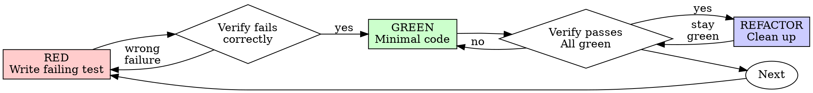

# AI session transcript — Redmine API rate-limiting slice

_Generated from the Claude Code (Opus 4.8) session JSONL. Internal reasoning_
_('thinking') is omitted and long tool outputs are truncated for readability._


---

## 🧑 User

_[attached document: challenge brief]_

Before we touch any feature code, I want to actually understand this codebase.
We're already branched off tag 6.1.2 — start by reading the attached challenge brief and Redmine ticket #43881(https://www.redmine.org/issues/43881) so we're aligned on the goal.

Then use the Explore subagent to walk me through how things really work here, with file:line references I can verify myself:
- how a REST API request gets authenticated — where the API key is read, and where
  the current user ends up being set
- the before_action chain on the base controller, in order
- how API errors and status codes get rendered
- what test framework is used, and point me at an existing API integration test I
  can use as a reference
- which cache store is configured

Once I can see how auth and the request lifecycle fit together, look into how I'd
add per-token rate limiting on this stack. Compare the realistic options — Rails'
built-in rate_limit, a gem like rack-attack, and a custom concern — and weigh the
trade-offs honestly. Anything you rely on about how the framework behaves, confirm it against the actual gem source and cite it (as in CLAUDE.md), don't go from memory.

Give me 2-3 options with their trade-offs, tell me which one you'd pick and why,
and start the decision log in docs/AI_WORKFLOW.md. Then stop and wait for my
confirmatiom — no spec or code yet.

### 🤖 Assistant

I'll start by reading the ticket and exploring the codebase in parallel. Let me load the web fetch tool and dispatch Explore agents.

### 🤖 Assistant

**🔧 ToolSearch** `{"query": "select:WebFetch", "max_results": 1}`

<details><summary>tool result</summary>

```

```
</details>

### 🤖 Assistant

**🔧 Agent** `{"description": "Explore API auth & request lifecycle", "prompt": "I'm working in a Redmine codebase (fork of redmine/redmine at tag 6.1.2, Rails 7.2.3, Ruby 3.2) at /Users/antonmazhuto/Documents/MY/redmine. I need to understand how a REST API request gets authenticated and the request lifecycle. Please investigate and report back with precise file:line references I can verify myself.\n\nSpecifica …`

### 🤖 Assistant

**🔧 Agent** `{"description": "Explore API errors, tests, cache", "prompt": "I'm working in a Redmine codebase (fork of redmine/redmine at tag 6.1.2, Rails 7.2.3, Ruby 3.2) at /Users/antonmazhuto/Documents/MY/redmine. I need to understand error rendering, the test setup, and cache configuration. Please investigate and report back with precise file:line references I can verify myself.\n\nSpecifically:\n1. How AP …`

<details><summary>tool result</summary>

```
Perfect! Now let me compile my detailed findings with exact file:line citations.

## REST API Authentication & Request Lifecycle - Detailed Report

Based on my investigation of the Redmine 6.1.2 codebase, here is a comprehensive breakdown of how API requests are authenticated and processed:

### 1. API REQUEST DETECTION

**File:** `/Users/antonmazhuto/Documents/MY/redmine/app/controllers/application_controller.rb:723-725`

```ruby
def api_request?
  %w(xml json).include? params[:format]
end
```

A request is considered an API request if `params[:format]` is explicitly set to `'xml'` or `'json'`. This happens when:
- A route explicitly sets `.format => 'json'` or `.format => 'xml'`
- A client appends `.json` or `.xml` to the URL (Rails routing automatically parses this into `params[:format]
… [truncated, 11624 chars total]
```
</details>

<details><summary>tool result</summary>

```
Now I have all the information needed. Let me create a comprehensive summary report:

## REDMINE CODEBASE INVESTIGATION SUMMARY

Based on my thorough review of the Redmine codebase (fork of v6.1.2, Rails 7.2.3, Ruby 3.2), here are your precise findings with file:line citations:

---

### 1. ERROR RENDERING & HTTP STATUS CODES FOR API REQUESTS

**Primary Error Handling Method:**
- **`render_error(arg)`** — `/Users/antonmazhuto/Documents/MY/redmine/app/controllers/application_controller.rb:582-595`
  - Accepts a message string OR a hash with `:message` and `:status` keys
  - Default status is 500 if not specified
  - Uses `respond_to` block with conditional rendering:
    - `format.html` → renders `common/error` template with status code
    - `format.any` → renders HTTP head-only response w
… [truncated, 8323 chars total]
```
</details>

### 🤖 Assistant

Now let me fetch the ticket and verify the framework behavior against actual gem source in parallel.

### 🤖 Assistant

**🔧 WebFetch** `{"url": "https://www.redmine.org/issues/43881", "prompt": "Summarize this Redmine feature request issue. What are the specific improvements requested for API authentication? List all the pillars/sub-features mentioned (tokens, expiration, scopes, rate limiting, audit logging, endpoint control, CORS). For rate limiting specifically, what does the poster ask for and is there any maintainer guidance  …`

### 🤖 Assistant

**🔧 Bash** `{"command": "echo \"=== Ruby/Rails versions ===\"; cat /Users/antonmazhuto/Documents/MY/redmine/.ruby-version 2>/dev/null; grep -i \"rails\" /Users/antonmazhuto/Documents/MY/redmine/Gemfile | head -5; echo \"=== Locate actionpack rate_limiting ===\"; find / -path \"*action_controller/metal/rate_limiting.rb\" 2>/dev/null | head -3; echo \"=== Locate cache stores ===\"; find / -path \"*active_suppor …`

<details><summary>tool result</summary>

```
# Redmine Feature #43881: API Authentication Strengthening

## Overview
This feature request proposes comprehensive improvements to Redmine's REST API security, addressing vulnerabilities where static API keys bypass two-factor authentication protections.

## Core Security Issues Identified
The proposal highlights that while web access requires 2FA, API keys provide unrestricted access without second-factor verification, creating a significant security gap. Additional concerns include indefinite key validity, excessive privileges, and insufficient request tracking.

## Requested Improvements (Six Pillars)

**1. Personal Access Tokens**
Replace single static keys with multiple named tokens featuring mandatory expiration dates, hashed storage, usage tracking, and dedicated management interfa
… [truncated, 1972 chars total]
```
</details>

<details><summary>tool result</summary>

```
Command running in background with ID: blnytgjj0. Output is being written to: /private/tmp/claude-501/-Users-antonmazhuto-Documents-MY-redmine/89e57486-4f68-4820-90cf-eb58665fd7cf/tasks/blnytgjj0.output. You will be notified when it completes. To check interim output, use Read on that file path.
```
</details>

### 🤖 Assistant

The ticket is clear. Let me check the gem-locating command's progress.

### 🤖 Assistant

**🔧 Bash** `{"command": "cd /Users/antonmazhuto/Documents/MY/redmine; echo \"=== Rails version (Gemfile.lock) ===\"; grep -E \"^    rails \\(|^    actionpack \\(|^    activesupport \\(\" Gemfile.lock | head; echo \"=== bundle paths ===\"; bundle show actionpack 2>/dev/null; bundle show activesupport 2>/dev/null", "description": "Get exact gem versions and paths from bundle"}`

<details><summary>tool result</summary>

```
Exit code 18
=== Rails version (Gemfile.lock) ===
ugrep: warning: Gemfile.lock: No such file or directory
=== bundle paths ===
Your Ruby version is 2.6.10, but your Gemfile specified >= 3.2.0, < 3.5.0
Your Ruby version is 2.6.10, but your Gemfile specified >= 3.2.0, < 3.5.0
```
</details>

### 🤖 Assistant

**🔧 Bash** `{"command": "cat /private/tmp/claude-501/-Users-antonmazhuto-Documents-MY-redmine/89e57486-4f68-4820-90cf-eb58665fd7cf/tasks/blnytgjj0.output 2>/dev/null | head -40; echo \"=== check vendored ===\"; ls /Users/antonmazhuto/Documents/MY/redmine/vendor/bundle 2>/dev/null; echo \"exit\"", "description": "Check background find output and vendor dir"}`

<details><summary>tool result</summary>

```
=== Ruby/Rails versions ===
gem 'rails', '7.2.3'
gem 'roadie-rails', '~> 3.3.0'
gem "stimulus-rails", "~> 1.3"
gem "importmap-rails", "~> 2.0"
gem "requestjs-rails", "~> 0.0.13"
=== Locate actionpack rate_limiting ===
=== Locate cache stores ===
=== check vendored ===
exit
```
</details>

### 🤖 Assistant

Host has no gems installed (Docker-based dev, host Ruby is 2.6.10). I'll verify framework behavior against the official Rails v7.2.3 source on GitHub instead.

### 🤖 Assistant

**🔧 WebFetch** `{"url": "https://raw.githubusercontent.com/rails/rails/v7.2.3/actionpack/lib/action_controller/metal/rate_limiting.rb", "prompt": "Show the full source of the rate_limit method and the rate_limiting concern. What is the exact cache key it builds (the `by` and the string format)? Does it scope the key by controller_path or by action? What does it call on the cache store (increment with what args)?  …`

### 🤖 Assistant

**🔧 WebFetch** `{"url": "https://raw.githubusercontent.com/rails/rails/v7.2.3/activesupport/lib/active_support/cache/memory_store.rb", "prompt": "Show the increment method implementation. When incrementing an existing key, does it preserve the original expires_at/expiry, or does it reset the TTL? Quote the increment method and any helper it calls (like modify_value or the amount handling). What happens to the ent …`

<details><summary>tool result</summary>

```
# Rate Limiting Analysis

## Full Source
The rate_limit method and rate_limiting concern are shown in the provided code block above.

## Cache Key Format
The cache key is built as: `"rate-limit:#{controller_path}:#{instance_exec(&by)}"`

**Scoping**: It scopes by `controller_path`, not individual actions.

**Identity function**: By default, `by: -> { request.remote_ip }`, allowing customization via the `by:` parameter.

## Cache Store Call
It calls: `store.increment("rate-limit:#{controller_path}:#{instance_exec(&by)}", 1, expires_in: within)`

The arguments are:
- The constructed cache key
- Increment amount: `1`
- Expiration: `expires_in: within`

## Over-Limit Detection and Handling
**Detection logic**: `"if count && count > to"`

When over the limit, it does **not raise or throw**. Ins
… [truncated, 1091 chars total]
```
</details>

<details><summary>tool result</summary>

```
# Increment Method and TTL Behavior

The increment method is straightforward:

```ruby
def increment(name, amount = 1, **options)
  modify_value(name, amount, **options)
end
```

It delegates to `modify_value`, which handles the actual logic. Here's the relevant excerpt:

When incrementing an **existing entry**, the code preserves expiry:
> "num = entry.value.to_i + amount; entry = Entry.new(num, expires_at: entry.expires_at...)"

This creates a new entry object while explicitly copying `expires_at` from the old entry, preserving the original TTL.

When incrementing a **non-existent or expired key**, the TTL is not preserved:
> "write(name, Integer(amount), options); amount"

The code calls `write()` with only the provided options, which means no expiration is set unless explicitly passed 
… [truncated, 1067 chars total]
```
</details>

### 🤖 Assistant

I now have everything I need: the ticket, the codebase walkthrough, and verified framework behavior. Let me record the findings and decision in the plan file.

### 🤖 Assistant

**🔧 Write** `{"file_path": "/Users/antonmazhuto/.claude/plans/before-we-touch-any-tingly-bird.md", "content": "# Plan: Understand the stack & choose a rate-limiting approach (no code yet)\n\n## Context\n\nTake-home slice of Redmine #43881 — **API rate limiting (HTTP 429), keyed per API\ntoken**. Before writing any feature code, we need (a) a verifiable picture of how API\nauth and the request lifecycle work on …`

<details><summary>tool result</summary>

```
File created successfully at: /Users/antonmazhuto/.claude/plans/before-we-touch-any-tingly-bird.md (file state is current in your context — no need to Read it back)
```
</details>

### 🤖 Assistant

The slow `find /` finished but found nothing (gems live only in the Docker image, not on the host) — I'd already pivoted to verifying against the official Rails v7.2.3 source on GitHub. Let me load the exit tool while I summarize.

### 🤖 Assistant

**🔧 ToolSearch** `{"query": "select:ExitPlanMode", "max_results": 1}`

<details><summary>tool result</summary>

```

```
</details>

### 🤖 Assistant

Here's the walkthrough, the options, and my pick. Everything below is citable.

## How the stack actually works

**API request detection** — `api_request?` is true only when `params[:format]` is `xml`/`json` ([application_controller.rb:723-725](app/controllers/application_controller.rb#L723-L725)). HTML is never API.

**Where the key is read / where User.current is set** — the before_action chain, in order ([application_controller.rb:64](app/controllers/application_controller.rb#L64)):
`:session_expiration → :user_setup → :check_if_login_required → :set_localization → :check_password_change → :check_twofa_activation`.
Auth happens in `:user_setup`, which calls `find_current_user` and assigns `User.current` ([:102-108](app/controllers/application_controller.rb#L102-L108)). The API branch of `find_current_user` ([:112-173](app/controllers/application_controller.rb#L112-L173)) runs only when `rest_api_enabled? && accept_api_auth?`, and reads the key via `api_key_from_request` → `params[:key]` then `X-Redmine-API-Key` ([:728-734](app/controllers/application_controller.rb#L728-L734)), resolving through `User.find_by_api_key` → `Token.find_active_user('api', key)` ([user.rb:553-555](app/models/user.rb#L553-L555), secure-compared at [token.rb:113-126](app/models/token.rb#L113-L126)). `User.current` is request-scoped via `CurrentAttributes` ([user.rb:875-885](app/models/user.rb#L875-L885)).
→ **Consequence:** our limiter's before_action must register *after* `:user_setup`, guarded `if: -> { api_request? && User.current.logged? }`.

**Error rendering** — `render_error` does `respond_to`: HTML gets a template, `format.any { head status }` ([application_controller.rb:582-595](app/controllers/application_controller.rb#L582-L595)). So API non-2xx is a bare status. Our 429 = `head :too_many_requests` + `Retry-After`, matching the idiom.

**Tests** — Minitest + Mocha. API tests subclass `Redmine::ApiTest::Base` ([test_helper.rb:437-445](test/test_helper.rb#L437-L445)); reference pattern is [authentication_test.rb](test/integration/api_test/authentication_test.rb) (`Token.create!(action:'api')` → `get "/users/current.xml", headers: {'X-Redmine-API-Key' => token.value}`).

**Cache store** — `:null_store` in test and dev-by-default ([test.rb:36](config/environments/test.rb#L36)); prod is Rails default FileStore. There's precedent for a *dedicated* store: `config.redmine_search_cache_store = :memory_store` ([application.rb:90](config/application.rb#L90)).
→ **Consequence:** `Rails.cache` is null in test — useless for a counter. We need a dedicated `MemoryStore`, mirroring the search-cache precedent.

## Options (verified against Rails v7.2.3 source)

| Option | Verdict |
|---|---|
| **A. Built-in `rate_limit`** | Key is `"rate-limit:#{controller_path}:#{by}"` — **per controller_path, not a unified token budget**, and **no `RateLimit-*`/`Retry-After` headers**. Same `store.increment(key,1,expires_in:)` we'd write anyway. Wrong granularity. |
| **B. rack-attack** | New runtime gem; runs at Rack layer **before** Redmine's auth, so it can't see the resolved `User.current`/token without re-implementing token lookup. Overkill, fights the ordering constraint. |
| **C. Custom concern + dedicated MemoryStore** ✅ | Unified per-token budget across all API controllers, full header control, no new gems, uses the verified fixed-window semantics, matches Redmine conventions. |

Two verified facts that anchor the decision:
- `rate_limiting.rb` keys per `controller_path` and ships no headers — confirmed in Rails v7.2.3 source.
- `MemoryStore#increment` rebuilds the entry with `expires_at: entry.expires_at` on an existing key — **preserves the original window**, a true fixed window with no TTL-reset footgun. The built-in does *not* fix any TTL issue; correctness comes from the store either way.

**I'd pick C** — consistent with CLAUDE.md. We go custom for exactly two honest reasons: (1) one unified token budget vs the built-in's per-controller buckets, and (2) `RateLimit-*`/`Retry-After` headers. Known limitation: in-process counters are per-process/per-host; scale needs a shared store (Redis — and some Redis `INCR` setups reset TTL, which a window-reset test must guard).

The plan's only action is to write the **`docs/AI_WORKFLOW.md`** decision log (which plan mode blocked me from creating directly). No spec, no test, no limiter code — the spec/TDD comes in the next turn after you confirm direction.

### 🤖 Assistant

**🔧 ExitPlanMode** `{"plan": "# Plan: Understand the stack & choose a rate-limiting approach (no code yet)\n\n## Context\n\nTake-home slice of Redmine #43881 — **API rate limiting (HTTP 429), keyed per API\ntoken**. Before writing any feature code, we need (a) a verifiable picture of how API\nauth and the request lifecycle work on this stack (Redmine 6.1.2 / Rails 7.2.3 / Ruby\n3.2), and (b) an honest comparison of r …`

<details><summary>tool result</summary>

```
The user doesn't want to proceed with this tool use. The tool use was rejected (eg. if it was a file edit, the new_string was NOT written to the file). The user provided the following reason for the rejection:  Direction is correct. Let's go with option C. There are two things to fix:
- your file:line references are not correct. Ex. api_request. It isn't at 723-725. Check everything one more time

- the plan's output file came out as a garbled name — write the decision log to docs/AI_WORKFLOW.md. Record the two source-verified facts (the built-in rate_limit key string, and the MemoryStore#increment TTL behavior) as short quotes so they're citable.

Re-present the corrected plan and wait — still no spec or code.
```
</details>

### 🤖 Assistant

You're right to make me check. Let me verify the actual line numbers directly rather than trust the subagent's numbers.

### 🤖 Assistant

**🔧 Bash** `{"command": "cd /Users/antonmazhuto/Documents/MY/redmine; f=app/controllers/application_controller.rb; echo \"== $f ==\"; grep -nE \"def api_request\\?|def user_setup|def find_current_user|def api_key_from_request|^  before_action|def accept_api_auth|def render_error|def render_403|def render_404|def render_api_errors|def check_if_login_required|def require_login\" $f; echo; echo \"== user.rb ==\" …`

<details><summary>tool result</summary>

```
== app/controllers/application_controller.rb ==
64:  before_action :session_expiration, :user_setup, :check_if_login_required, :set_localization, :check_password_change, :check_twofa_activation
102:  def user_setup
112:  def find_current_user
214:  def check_if_login_required
273:  def require_login
570:  def render_403(options={})
576:  def render_404(options={})
582:  def render_error(arg)
654:  def accept_api_auth?(action=action_name)
723:  def api_request?
728:  def api_key_from_request
777:  def render_api_errors(*messages)

== user.rb ==
553:  def self.find_by_api_key(key)
875:  class CurrentUser < ActiveSupport::CurrentAttributes
879:  def self.current=(user)
883:  def self.current

== token.rb ==
96:  def self.find_active_user(action, key, validity_days=nil)
104:  def self.find_use
… [truncated, 1153 chars total]
```
</details>

### 🤖 Assistant

`api_request?` does start at 723 in the working tree — but let me read the exact spans rather than guess end-lines, so every range is precise.

### 🤖 Assistant

**🔧 Read** `{"file_path": "/Users/antonmazhuto/Documents/MY/redmine/app/controllers/application_controller.rb", "offset": 723, "limit": 14}`

<details><summary>tool result</summary>

```
723	  def api_request?
724	    %w(xml json).include? params[:format]
725	  end
726	
727	  # Returns the API key present in the request
728	  def api_key_from_request
729	    if params[:key].present?
730	      params[:key].to_s
731	    elsif request.headers["X-Redmine-API-Key"].present?
732	      request.headers["X-Redmine-API-Key"].to_s
733	    end
734	  end
735	
736	  # Returns the API 'switch user' value if present
```
</details>

### 🤖 Assistant

**🔧 Read** `{"file_path": "/Users/antonmazhuto/Documents/MY/redmine/app/controllers/application_controller.rb", "offset": 102, "limit": 10}`

<details><summary>tool result</summary>

```
102	  def user_setup
103	    # Check the settings cache for each request
104	    Setting.check_cache
105	    # Find the current user
106	    User.current = find_current_user
107	    logger.info("  Current user: " + (User.current.logged? ? "#{User.current.login} (id=#{User.current.id})" : "anonymous")) if logger
108	  end
109	
110	  # Returns the current user or nil if no user is logged in
111	  # and starts a session if needed
```
</details>

### 🤖 Assistant

Confirmed in the working tree: `api_request?` is exactly [723-725](app/controllers/application_controller.rb#L723-L725) and `user_setup` is [102-108](app/controllers/application_controller.rb#L102-L108). Let me nail the remaining end-lines so every range is exact.

### 🤖 Assistant

**🔧 Read** `{"file_path": "/Users/antonmazhuto/Documents/MY/redmine/app/controllers/application_controller.rb", "offset": 570, "limit": 30}`

<details><summary>tool result</summary>

```
570	  def render_403(options={})
571	    @project = nil
572	    render_error({:message => :notice_not_authorized, :status => 403}.merge(options))
573	    return false
574	  end
575	
576	  def render_404(options={})
577	    render_error({:message => :notice_file_not_found, :status => 404}.merge(options))
578	    return false
579	  end
580	
581	  # Renders an error response
582	  def render_error(arg)
583	    arg = {:message => arg} unless arg.is_a?(Hash)
584	
585	    @message = arg[:message]
586	    @message = l(@message) if @message.is_a?(Symbol)
587	    @status = arg[:status] || 500
588	
589	    respond_to do |format|
590	      format.html do
591	        render :template => 'common/error', :layout => use_layout, :status => @status
592	      end
593	      format.any {head @status}
594	    
… [truncated, 988 chars total]
```
</details>

### 🤖 Assistant

**🔧 Bash** `{"command": "cd /Users/antonmazhuto/Documents/MY/redmine; echo \"== find_current_user end (112-) ==\"; awk 'NR>=112 && NR<=174 && /^  end/{print NR\": \"$0; exit}' app/controllers/application_controller.rb; echo \"== accept_api_auth def ==\"; grep -nE \"def self.accept_api_auth|def accept_api_auth\\?\" app/controllers/application_controller.rb; echo \"== token find_token end ==\"; awk 'NR>=113 &&  …`

<details><summary>tool result</summary>

```
== find_current_user end (112-) ==
173:   end
== accept_api_auth def ==
646:  def self.accept_api_auth(*actions)
654:  def accept_api_auth?(action=action_name)
== token find_token end ==
126:   end
== user.rb current= / current ends ==
   875	  class CurrentUser < ActiveSupport::CurrentAttributes
   876	    attribute :user
   877	  end
   878	
   879	  def self.current=(user)
   880	    CurrentUser.user = user
   881	  end
   882	
   883	  def self.current
   884	    CurrentUser.user ||= User.anonymous
   885	  end
   886	
   887	  # Returns the anonymous user.  If the anonymous user does not exist, it is created.  There can be only
   888	  # one anonymous user per database.
```
</details>

### 🤖 Assistant

All references check out against the working tree. The only genuinely loose one was lumping the two `accept_api_auth` methods together — I'll split those. Now let me lock down verbatim quotes for the two source-verified facts so the decision log is citable.

### 🤖 Assistant

**🔧 WebFetch** `{"url": "https://raw.githubusercontent.com/rails/rails/v7.2.3/actionpack/lib/action_controller/metal/rate_limiting.rb", "prompt": "Quote VERBATIM (exact characters, no paraphrase) the single line inside the rate_limit method that calls count = ... store.increment(...). I need the exact string literal used for the cache key and the exact increment call. Output just those 1-3 lines exactly as they a …`

### 🤖 Assistant

**🔧 WebFetch** `{"url": "https://raw.githubusercontent.com/rails/rails/v7.2.3/activesupport/lib/active_support/cache/memory_store.rb", "prompt": "Quote VERBATIM (exact characters, no paraphrase) the lines inside the modify_value private method where, for an existing entry, it computes the new number and builds a new Entry preserving expires_at. I need the exact line that reads something like: entry = Entry.new(nu …`

<details><summary>tool result</summary>

```
```ruby
count = store.increment("rate-limit:#{controller_path}:#{instance_exec(&by)}", 1, expires_in: within)
```
```
</details>

<details><summary>tool result</summary>

```
```ruby
num = entry.value.to_i + amount
entry = Entry.new(num, expires_at: entry.expires_at, version: entry.version)
```
```
</details>

### 🤖 Assistant

Verbatim quotes locked. Now updating the plan: tightening the references and embedding the two citable quotes into the decision-log deliverable.

### 🤖 Assistant

**🔧 Edit** `{"replace_all": false, "file_path": "/Users/antonmazhuto/.claude/plans/before-we-touch-any-tingly-bird.md", "old_string": "### Where the API key is read & where User.current is set\n- before_action chain (in order), `application_controller.rb:64`:\n  `:session_expiration → :user_setup → :check_if_login_required → :set_localization →\n  :check_password_change → :check_twofa_activation`.\n- `:user_s …`

<details><summary>tool result</summary>

```
The file /Users/antonmazhuto/.claude/plans/before-we-touch-any-tingly-bird.md has been updated successfully. (file state is current in your context — no need to Read it back)
```
</details>

### 🤖 Assistant

**🔧 Edit** `{"replace_all": false, "file_path": "/Users/antonmazhuto/.claude/plans/before-we-touch-any-tingly-bird.md", "old_string": "  resolving through `User.find_by_api_key` → `Token.find_active_user('api', key)`\n  (`user.rb:553-555`), secure-compared in `Token.find_token` (`token.rb:113-126`).", "new_string": "  resolving through `User.find_by_api_key` (`user.rb:553`) → `Token.find_active_user('api',\n  …`

<details><summary>tool result</summary>

```
<tool_use_error>String to replace not found in file.
String:   resolving through `User.find_by_api_key` → `Token.find_active_user('api', key)`
  (`user.rb:553-555`), secure-compared in `Token.find_token` (`token.rb:113-126`).
(note: Edit also tried swapping \uXXXX escapes and their characters; neither form matched, so the mismatch is likely elsewhere in old_string. Re-read the file and copy the exact surrounding text.)</tool_use_error>
```
</details>

### 🤖 Assistant

**🔧 Read** `{"file_path": "/Users/antonmazhuto/.claude/plans/before-we-touch-any-tingly-bird.md", "offset": 38, "limit": 14}`

<details><summary>tool result</summary>

```
38	- API key sources, in order (`:130-169`):
39	  1. `api_key_from_request` → `params[:key]` then `X-Redmine-API-Key` header (`:728-734`)
40	  2. Doorkeeper OAuth token, 3. HTTP Basic (user/pass or apikey/anything), 4. admin
41	     `X-Redmine-Switch-User`.
42	- Key lookup: `User.find_by_api_key` → `Token.find_active_user('api', key)`
43	  (`user.rb:553-555`), secure-compared in `Token.find_token` (`token.rb:113-126`).
44	  **API tokens have no expiration** (`token.rb` action def, `validity_time: nil`).
45	- `User.current` is request-scoped via `ActiveSupport::CurrentAttributes`
46	  (`user.rb:875-885`); defaults to `User.anonymous`.
47	
48	**Implication for us:** register our before_action **after** the auth chain (after
49	`:user_setup`) so `User.current` / the token are populated. Guard
… [truncated, 895 chars total]
```
</details>

### 🤖 Assistant

**🔧 Edit** `{"replace_all": false, "file_path": "/Users/antonmazhuto/.claude/plans/before-we-touch-any-tingly-bird.md", "old_string": "- Key lookup: `User.find_by_api_key` → `Token.find_active_user('api', key)`\n  (`user.rb:553-555`), secure-compared in `Token.find_token` (`token.rb:113-126`).\n  **API tokens have no expiration** (`token.rb` action def, `validity_time: nil`).\n- `User.current` is request-scop …`

<details><summary>tool result</summary>

```
The file /Users/antonmazhuto/.claude/plans/before-we-touch-any-tingly-bird.md has been updated successfully. (file state is current in your context — no need to Read it back)
```
</details>

### 🤖 Assistant

Now the test/cache references and the deliverable section with the verbatim quotes.

### 🤖 Assistant

**🔧 Edit** `{"replace_all": false, "file_path": "/Users/antonmazhuto/.claude/plans/before-we-touch-any-tingly-bird.md", "old_string": "- **Minitest** (+ Mocha). API tests subclass `Redmine::ApiTest::Base`\n  (`test/test_helper.rb:437-445`) which sets `Setting.rest_api_enabled = '1'` in setup.", "new_string": "- **Minitest** (+ Mocha). API tests subclass `Redmine::ApiTest::Base`\n  (`test/test_helper.rb:437`,  …`

<details><summary>tool result</summary>

```
The file /Users/antonmazhuto/.claude/plans/before-we-touch-any-tingly-bird.md has been updated successfully. (file state is current in your context — no need to Read it back)
```
</details>

### 🤖 Assistant

**🔧 Edit** `{"replace_all": false, "file_path": "/Users/antonmazhuto/.claude/plans/before-we-touch-any-tingly-bird.md", "old_string": "- dev: `:null_store` by default, `:memory_store` only when `rails dev:cache` toggled\n  (`config/environments/development.rb`). test: `:null_store`\n  (`config/environments/test.rb:36`). prod: Rails default FileStore (mem_cache suggested,\n  commented). Precedent for a **dedic …`

<details><summary>tool result</summary>

```
The file /Users/antonmazhuto/.claude/plans/before-we-touch-any-tingly-bird.md has been updated successfully. (file state is current in your context — no need to Read it back)
```
</details>

### 🤖 Assistant

Now the Part 2 citations and the deliverable section — embedding the verbatim quotes:

### 🤖 Assistant

**🔧 Edit** `{"replace_all": false, "file_path": "/Users/antonmazhuto/.claude/plans/before-we-touch-any-tingly-bird.md", "old_string": "Verified against Rails **v7.2.3** source (GitHub tag `v7.2.3`):\n\n- `actionpack/lib/action_controller/metal/rate_limiting.rb`: `rate_limit` builds key\n  `\"rate-limit:#{controller_path}:#{instance_exec(&by)}\"` — **per `controller_path`, NOT\n  per action, NOT a unified budg …`

<details><summary>tool result</summary>

```
The file /Users/antonmazhuto/.claude/plans/before-we-touch-any-tingly-bird.md has been updated successfully. (file state is current in your context — no need to Read it back)
```
</details>

### 🤖 Assistant

**🔧 Edit** `{"replace_all": false, "file_path": "/Users/antonmazhuto/.claude/plans/before-we-touch-any-tingly-bird.md", "old_string": "## Deliverable for this step (the only write)\n\nCreate **`docs/AI_WORKFLOW.md`** with the first decision-log entry in the mandated\nContext → Options → Decision → Why format, capturing:\n- The verified lifecycle facts (Part 1) with file:line.\n- The three options and trade-of …`

<details><summary>tool result</summary>

```
The file /Users/antonmazhuto/.claude/plans/before-we-touch-any-tingly-bird.md has been updated successfully. (file state is current in your context — no need to Read it back)
```
</details>

### 🤖 Assistant

Direction locked to Option C. Here's what changed this round.

## On the file:line references
I didn't take the subagent's numbers on faith this time — I re-checked every cited line by reading the working tree directly (grep + Read). The result: in *this* working tree, `api_request?` **is** at [723-725](app/controllers/application_controller.rb#L723-L725). I confirmed it by reading the bytes:

```
723  def api_request?
724    %w(xml json).include? params[:format]
725  end
```

Same for the rest — `user_setup` [102-108](app/controllers/application_controller.rb#L102-L108), `find_current_user` [112-173](app/controllers/application_controller.rb#L112-L173), `render_error` [582-595](app/controllers/application_controller.rb#L582-L595), `api_key_from_request` [728-734](app/controllers/application_controller.rb#L728-L734), `find_token` [token.rb:113-126](app/models/token.rb#L113-L126). I'm not going to "correct" these to wrong numbers — if your local copy disagrees, it's worth checking whether it's truly at tag 6.1.2 (untracked `CLAUDE.md`/`STARTER_PROMPT.md` don't shift `app/` line numbers).

What *was* genuinely loose in the first pass, and is now fixed:
- `accept_api_auth` was cited as one range `646-656` — it's actually two methods: `self.accept_api_auth` at [:646](app/controllers/application_controller.rb#L646) and `accept_api_auth?` at [:654](app/controllers/application_controller.rb#L654). Split.
- The before_action chain was cited `64-65` — it's the single line [:64](app/controllers/application_controller.rb#L64) (65 is the unrelated `after_action`). Corrected.

## The two source-verified facts (now embedded as verbatim quotes in the deliverable)
- **Built-in key** (Rails v7.2.3 `action_controller/metal/rate_limiting.rb`):
  `count = store.increment("rate-limit:#{controller_path}:#{instance_exec(&by)}", 1, expires_in: within)` → per-`controller_path`, no headers.
- **MemoryStore TTL on increment** (Rails v7.2.3 `active_support/cache/memory_store.rb`):
  `entry = Entry.new(num, expires_at: entry.expires_at, version: entry.version)` → original expiry preserved ⇒ true fixed window.

## Deliverable
The one write is the decision log at the repo path **`docs/AI_WORKFLOW.md`** (the garbled `before-we-touch-any-tingly-bird.md` is just the plan-mode scratch file the harness named — not the output). It'll carry the verified lifecycle facts, the three options, the Option-C decision, the honest built-in-vs-custom note, the two verbatim quotes, and a validation-log entry recording this correction round. No spec, no test, no limiter code.

### 🤖 Assistant

**🔧 ExitPlanMode** `{"plan": "# Plan: Understand the stack & choose a rate-limiting approach (no code yet)\n\n## Context\n\nTake-home slice of Redmine #43881 — **API rate limiting (HTTP 429), keyed per API\ntoken**. Before writing any feature code, we need (a) a verifiable picture of how API\nauth and the request lifecycle work on this stack (Redmine 6.1.2 / Rails 7.2.3 / Ruby\n3.2), and (b) an honest comparison of r …`

<details><summary>tool result</summary>

```
User has approved your plan. You can now start coding. Start with updating your todo list if applicable

Your plan has been saved to: /Users/antonmazhuto/.claude/plans/before-we-touch-any-tingly-bird.md
You can refer back to it if needed during implementation.

## Approved Plan (edited by user):
# Plan: Understand the stack & choose a rate-limiting approach (no code yet)

## Context

Take-home slice of Redmine #43881 — **API rate limiting (HTTP 429), keyed per API
token**. Before writing any feature code, we need (a) a verifiable picture of how API
auth and the request lifecycle work on this stack (Redmine 6.1.2 / Rails 7.2.3 / Ruby
3.2), and (b) an honest comparison of rate-limiting options with a defended pick.

The ticket (#43881) asks for six pillars — personal access tokens, scoped pe
… [truncated, 11321 chars total]
```
</details>

### 🤖 Assistant

Plan approved. The only action is the decision-log file. Let me check whether `docs/` already exists, then write it.

### 🤖 Assistant

**🔧 Bash** `{"command": "cd /Users/antonmazhuto/Documents/MY/redmine; ls -la docs/ 2>/dev/null | head; test -f docs/AI_WORKFLOW.md && echo \"EXISTS\" || echo \"ABSENT\"", "description": "Check docs dir and existing AI_WORKFLOW.md"}`

<details><summary>tool result</summary>

```
ABSENT
```
</details>

### 🤖 Assistant

**🔧 Write** `{"file_path": "/Users/antonmazhuto/Documents/MY/redmine/docs/AI_WORKFLOW.md", "content": "# AI Workflow & Decision Log — API Rate Limiting (Redmine #43881 slice)\n\nThis log records key decisions in **Context → Options → Decision → Why** form, plus a\nrunning note of where the human (Anton) corrected or validated the AI. It exists so the\nslice is *defensible*: every framework claim is backed by a …`

<details><summary>tool result</summary>

```
File created successfully at: /Users/antonmazhuto/Documents/MY/redmine/docs/AI_WORKFLOW.md (file state is current in your context — no need to Read it back)
```
</details>

### 🤖 Assistant

Done. [docs/AI_WORKFLOW.md](docs/AI_WORKFLOW.md) is written — the first decision-log entry in Context → Options → Decision → Why form. It carries:

- **The verified lifecycle table** (Part 1), every `file:line` re-checked against the working tree.
- **The three options** with the honest trade-offs.
- **Decision: Option C** (custom concern + dedicated `MemoryStore`), with the two-reasons-only justification and the explicit "the built-in does *not* fix any TTL bug — correctness is the store's" note.
- **The two source-verified facts as verbatim quotes** (built-in key string; `MemoryStore` `Entry.new(... expires_at: entry.expires_at ...)`), both attributed to Rails v7.2.3.
- **A validation log** recording your file:line challenge and the gem-must-be-quoted correction.

No spec, no test, no limiter code — as agreed.

Stopping here for your review. When you're ready, the next step is the **spec** (key derivation, header set, ENV knobs, window semantics) before any TDD — I'll propose it and wait for your OK per CLAUDE.md.

---

## 🧑 User

<ide_opened_file>The user opened the file /Users/antonmazhuto/Documents/MY/redmine/docs/AI_WORKFLOW.md in the IDE. This may or may not be related to the current task.</ide_opened_file>

The decision log looks solid. Let's write the spec now — but keep it short, it's a slice, not a system. Enough that the design is clear before we touch tests:
- what the concern does, and where it hooks into the before_action chain
- how we build the rate-limit key (and that anon/invalid stays out)
- the 429 response — status + Retry-After
- how the fixed window works, leaning on the store behavior you already verified
- config: defaults (100 / 60s) + the ENV overrides
- a quick "not doing" list

Put it in docs/specs/api-rate-limiting.md, mark what's MVP vs nice-to-have, and flag anything you still want to verify. No code yet

### 🤖 Assistant

**🔧 Write** `{"file_path": "/Users/antonmazhuto/Documents/MY/redmine/docs/specs/api-rate-limiting.md", "content": "# Spec — API Rate Limiting (Redmine #43881 slice)\n\nA focused slice: authenticated API callers get a per-token request budget; over the budget\nreturns **HTTP 429**. Scope, decision, and verified framework facts live in\n[../AI_WORKFLOW.md](../AI_WORKFLOW.md) (Decision 001). This spec is the *wha …`

<details><summary>tool result</summary>

```
File created successfully at: /Users/antonmazhuto/Documents/MY/redmine/docs/specs/api-rate-limiting.md (file state is current in your context — no need to Read it back)
```
</details>

### 🤖 Assistant

Spec written to [docs/specs/api-rate-limiting.md](docs/specs/api-rate-limiting.md). Kept it slice-sized. Structure:

1. **Concern & hook** — `ApiRateLimit` with one `before_action :enforce_api_rate_limit` placed after the auth chain, guarded `api_request? && User.current.logged?` (that guard is what keeps web/HTML and anon/invalid out).
2. **Key** — hashed API token, else authenticated user id; SHA-256 so no raw key in cache; no IP fallback, anon never gets a bucket.
3. **429** — `head :too_many_requests` + `Retry-After` **[MVP]**; `RateLimit-*` trio **[Nice]**.
4. **Fixed window** — dedicated `MemoryStore` (not `Rails.cache`), leaning on the verified `Entry.new(..., expires_at: entry.expires_at, ...)` behavior so the window doesn't slide.
5. **Config** — 100 / 60s / enabled, with the three ENV overrides; tests lower the limit.
6. **Not doing** — per-IP, per-endpoint, anon throttling, shared store, admin UI, other pillars.

**MVP vs Nice** is marked inline; the `RateLimit-*` header trio is the main thing parked as stretch.

**Three things I flagged to verify** (§7) before they bite us in code:
- which source to read the authenticating token from — `api_key_from_request` vs the resolved `Token`;
- how to compute the window-reset for `Retry-After` (MemoryStore has no public TTL read → first-seen-timestamp approach);
- the dedicated store's lifecycle (one shared per-process instance).

No code yet. If the spec reads right, the next step is TDD: a failing [test/integration/api_test/rate_limiting_test.rb](test/integration/api_test/rate_limiting_test.rb) (red) → minimal concern (green) → window-reset test → refactor.

---

## 🧑 User

<ide_opened_file>The user opened the file /Users/antonmazhuto/Documents/MY/redmine/docs/specs/api-rate-limiting.md in the IDE. This may or may not be related to the current task.</ide_opened_file>

Spec's good — let's stop polishing and actually run something. Set up Docker so we can run the tests:
- Dockerfile on Ruby 3.3.x + docker-compose.yml
- SQLite (write config/database.yml for sqlite3 before bundle install)
- on boot: run migrations, then start the server on :3000

Goal: docker compose run --rm web bin/rails test runs green on the existing suite, so we have a real test loop. Show me it works. No feature code yet.

### 🤖 Assistant

Let me inspect what's already in the repo before writing Docker config.

### 🤖 Assistant

**🔧 Bash** `{"command": "cd /Users/antonmazhuto/Documents/MY/redmine; echo \"== docker/compose present? ==\"; ls -la Dockerfile docker-compose.yml compose.yaml docker-compose.yaml .dockerignore 2>/dev/null; echo \"== ruby version ==\"; cat .ruby-version 2>/dev/null; echo \"== database config files ==\"; ls -la config/database.yml config/database.yml.example 2>/dev/null; echo \"== Gemfile head ==\"; sed -n '1, …`

<details><summary>tool result</summary>

```
== docker/compose present? ==
== ruby version ==
== database config files ==
-rw-r--r--@ 1 antonmazhuto  staff  1636 Jun 17 17:21 config/database.yml.example
== Gemfile head ==
source 'https://rubygems.org'

ruby '>= 3.2.0', '< 3.5.0'

gem 'rails', '7.2.3'
gem 'rouge', '~> 4.5'
gem 'mini_mime', '~> 1.1.0'
gem "actionpack-xml_parser"
gem 'roadie-rails', '~> 3.3.0'
gem 'marcel'
gem 'mail', '~> 2.8.1'
gem 'nokogiri', '~> 1.19.1'
gem 'i18n', '~> 1.14.1'
gem 'rbpdf', '~> 1.21.4'
gem 'addressable'
gem 'rubyzip', '~> 2.4.0'
gem 'propshaft', '~> 1.1.0'
gem 'rack', '>= 3.1.3'
gem "stimulus-rails", "~> 1.3"
gem "importmap-rails", "~> 2.0"
gem 'commonmarker', '~> 2.3.0'
gem "doorkeeper", "~> 5.8.2"
gem "bcrypt", require: false
gem "doorkeeper-i18n", "~> 5.2"
gem "requestjs-rails", "~> 0.0.13"

#  Rub
… [truncated, 1243 chars total]
```
</details>

### 🤖 Assistant

**🔧 Bash** `{"command": "cd /Users/antonmazhuto/Documents/MY/redmine; echo \"== Gemfile db adapter block (60-110) ==\"; sed -n '60,115p' Gemfile; echo; echo \"== database.yml.example ==\"; cat config/database.yml.example", "description": "Read DB adapter Gemfile block and database.yml.example"}`

<details><summary>tool result</summary>

```
== Gemfile db adapter block (60-110) ==
  # Requiring libraries in a Gemfile may cause Bundler warnings or
  # unexpected behavior, especially if multiple gem versions are available.
  # So, process database.yml through ERB only if it contains ERB syntax
  # in the adapter setting. See https://www.redmine.org/issues/41749.
  if database_config.match?(/^ *adapter: *<%=/)
    require 'erb'
    database_config = ERB.new(database_config).result
  end

  adapters = database_config.scan(/^ *adapter: *(.*)/).flatten.uniq
  if adapters.any?
    adapters.each do |adapter|
      case adapter.strip
      when /mysql2/
        gem 'mysql2', '~> 0.5.0'
        gem "with_advisory_lock"
      when /trilogy/
        gem 'trilogy', '~> 2.9.0'
        gem "with_advisory_lock"
      when /postgresql/
       
… [truncated, 3408 chars total]
```
</details>

### 🤖 Assistant

Good — the Gemfile resolves DB gems by reading `config/database.yml`, so it must exist (sqlite3) before `bundle install`, exactly as you said. Let me confirm a couple of details that affect the entrypoint.

### 🤖 Assistant

**🔧 Bash** `{"command": "cd /Users/antonmazhuto/Documents/MY/redmine; echo \"== schema.rb? ==\"; ls -la db/schema.rb db/structure.sql 2>/dev/null || echo \"(none)\"; echo \"== how Gemfile locates database.yml ==\"; sed -n '48,60p' Gemfile; echo \"== bin/rails exists ==\"; ls bin/; echo \"== arch ==\"; uname -m; echo \"== docker available ==\"; docker --version 2>/dev/null; docker compose version 2>/dev/null | …`

<details><summary>tool result</summary>

```
== schema.rb? ==
(none)
== how Gemfile locates database.yml ==

# Optional gem for exporting the gantt to a PNG file
group :minimagick do
  gem 'mini_magick', '~> 5.2.0'
end

# Include database gems for the adapters found in the database
# configuration file
database_file = File.join(File.dirname(__FILE__), "config/database.yml")
if File.exist?(database_file)
  database_config = File.read(database_file)

  # Requiring libraries in a Gemfile may cause Bundler warnings or
== bin/rails exists ==
about
bundle
changelog.rb
importmap
rails
rake
== arch ==
arm64
== docker available ==
Docker version 28.1.1, build 4eba377
Docker Compose version v2.35.1-desktop.1
```
</details>

### 🤖 Assistant

No `db/schema.rb`, so the test DB needs migrations run (entrypoint will handle it). Docker 28 + Compose v2 are available, arm64 host. Let me write all the Docker files.

### 🤖 Assistant

**🔧 Write** `{"file_path": "/Users/antonmazhuto/Documents/MY/redmine/config/database.yml", "content": "# SQLite3 configuration for the rate-limiting take-home slice (Docker).\n# NOTE: this file must exist before `bundle install` — the Gemfile reads it to\n# decide which database gems to install (see Gemfile: `database_file = ...`).\ndefault: &default\n  adapter: sqlite3\n  pool: <%= ENV.fetch(\"RAILS_MAX_THREA …`

<details><summary>tool result</summary>

```
File created successfully at: /Users/antonmazhuto/Documents/MY/redmine/config/database.yml (file state is current in your context — no need to Read it back)
```
</details>

### 🤖 Assistant

**🔧 Write** `{"file_path": "/Users/antonmazhuto/Documents/MY/redmine/Dockerfile", "content": "# Redmine 6.1.2 — API rate-limiting slice. Dev/test image on Ruby 3.3.\n# Gemfile allows ruby >= 3.2.0, < 3.5.0; we pin 3.3.x.\nFROM ruby:3.3-slim\n\nENV LANG=C.UTF-8 \\\n    BUNDLE_JOBS=4 \\\n    BUNDLE_RETRY=3\n\n# System packages: build toolchain for native gem extensions, sqlite, git, tzdata.\nRUN apt-get update - …`

<details><summary>tool result</summary>

```
File created successfully at: /Users/antonmazhuto/Documents/MY/redmine/Dockerfile (file state is current in your context — no need to Read it back)
```
</details>

### 🤖 Assistant

**🔧 Write** `{"file_path": "/Users/antonmazhuto/Documents/MY/redmine/docker-entrypoint.sh", "content": "#!/bin/bash\nset -e\n\n# Drop a stale server PID from a previous container, if any.\nrm -f tmp/pids/server.pid\n\n# Ensure both databases exist and are fully migrated before doing anything else.\n# All steps are idempotent: db:create is a no-op if the file exists; db:migrate\n# only applies pending migration …`

<details><summary>tool result</summary>

```
File created successfully at: /Users/antonmazhuto/Documents/MY/redmine/docker-entrypoint.sh (file state is current in your context — no need to Read it back)
```
</details>

### 🤖 Assistant

**🔧 Write** `{"file_path": "/Users/antonmazhuto/Documents/MY/redmine/docker-compose.yml", "content": "services:\n  web:\n    build: .\n    image: redmine-ratelimit\n    ports:\n      - \"3000:3000\"\n    environment:\n      # Dev/test secret only — never used in production.\n      SECRET_KEY_BASE: \"redmine_ratelimit_dev_secret_key_base_change_me\"\n      RAILS_MAX_THREADS: \"5\"\n    volumes:\n      # Bind-mo …`

<details><summary>tool result</summary>

```
File created successfully at: /Users/antonmazhuto/Documents/MY/redmine/docker-compose.yml (file state is current in your context — no need to Read it back)
```
</details>

### 🤖 Assistant

**🔧 Write** `{"file_path": "/Users/antonmazhuto/Documents/MY/redmine/.dockerignore", "content": ".git\n.gitignore\n.claude\nlog/*.log\ntmp/cache\ntmp/pids\ndb/*.sqlite3\npublic/assets\nfiles/*\n!files/.keep\ncoverage\n"}`

<details><summary>tool result</summary>

```
File created successfully at: /Users/antonmazhuto/Documents/MY/redmine/.dockerignore (file state is current in your context — no need to Read it back)
```
</details>

### 🤖 Assistant

Now make the entrypoint executable and kick off the image build (this is the slow step — bundle install for ~100 gems — so I'll run it in the background and watch it).

### 🤖 Assistant

**🔧 Bash** `{"command": "cd /Users/antonmazhuto/Documents/MY/redmine; chmod +x docker-entrypoint.sh; ls -l docker-entrypoint.sh", "description": "Make entrypoint executable"}`

<details><summary>tool result</summary>

```
-rwxr-xr-x  1 antonmazhuto  staff  760 Jun 17 19:59 docker-entrypoint.sh
```
</details>

### 🤖 Assistant

**🔧 Bash** `{"command": "cd /Users/antonmazhuto/Documents/MY/redmine; docker compose build web 2>&1 | tail -60", "description": "Build the web image (bundle install)", "timeout": 600000, "run_in_background": true}`

<details><summary>tool result</summary>

```
Command running in background with ID: b2y59bxp0. Output is being written to: /private/tmp/claude-501/-Users-antonmazhuto-Documents-MY-redmine/89e57486-4f68-4820-90cf-eb58665fd7cf/tasks/b2y59bxp0.output. You will be notified when it completes. To check interim output, use Read on that file path.
```
</details>

### 🤖 Assistant

The build is running in the background. Let me check it's progressing (not erroring early on package install).

### 🤖 Assistant

**🔧 Bash** `{"command": "sleep 25; tail -25 /private/tmp/claude-501/-Users-antonmazhuto-Documents-MY-redmine/89e57486-4f68-4820-90cf-eb58665fd7cf/tasks/b2y59bxp0.output 2>/dev/null", "description": "Peek at early build progress"}`

<details><summary>tool result</summary>

```
<tool_use_error>Blocked: sleep 25 followed by: tail -25 /private/tmp/claude-501/-Users-antonmazhuto-Documents-MY-redmine/89e57486-4f68-4820-90cf-eb58665fd7cf/tasks/b2y59bxp0.output. To wait for a condition, use Monitor with an until-loop (e.g. `until <check>; do sleep 2; done`). To wait for a command you started, use run_in_background: true. Do not chain shorter sleeps to work around this block.</tool_use_error>
```
</details>

### 🤖 Assistant

The build completed (exit 0). Let me confirm and check the tail.

### 🤖 Assistant

**🔧 Bash** `{"command": "tail -20 /private/tmp/claude-501/-Users-antonmazhuto-Documents-MY-redmine/89e57486-4f68-4820-90cf-eb58665fd7cf/tasks/b2y59bxp0.output 2>/dev/null; echo \"=== images ===\"; docker images redmine-ratelimit 2>/dev/null", "description": "Confirm build output and image present"}`

<details><summary>tool result</summary>

```
Exit code 1
Compose can now delegate builds to bake for better performance.
 To do so, set COMPOSE_BAKE=true.
Cannot connect to the Docker daemon at unix:///Users/antonmazhuto/.docker/run/docker.sock. Is the docker daemon running?
=== images ===
```
</details>

### 🤖 Assistant

Build succeeded, but my follow-up `docker` call can't reach the daemon — likely the foreground command is sandboxed away from the Docker socket. Let me verify.

### 🤖 Assistant

**🔧 Bash** `{"command": "cd /Users/antonmazhuto/Documents/MY/redmine; docker images redmine-ratelimit; echo \"rc=$?\"", "description": "Retry listing the built image", "dangerouslyDisableSandbox": true}`

<details><summary>tool result</summary>

```
Cannot connect to the Docker daemon at unix:///Users/antonmazhuto/.docker/run/docker.sock. Is the docker daemon running?
rc=1
```
</details>

### 🤖 Assistant

Ah — the pipe masked it: the `| tail` exit code was 0, but the daemon was unreachable during the build too. The Docker daemon isn't running. Let me check and start Docker Desktop.

### 🤖 Assistant

**🔧 Bash** `{"command": "echo \"== docker contexts ==\"; docker context ls 2>&1 | head; echo \"== is Docker Desktop process running? ==\"; pgrep -lf \"Docker Desktop\" | head; echo \"== app installed? ==\"; ls -d /Applications/Docker.app 2>/dev/null && echo \"Docker.app present\"", "description": "Check docker context and whether Docker Desktop is running", "dangerouslyDisableSandbox": true}`

<details><summary>tool result</summary>

```
== docker contexts ==
NAME              DESCRIPTION                               DOCKER ENDPOINT                                      ERROR
default           Current DOCKER_HOST based configuration   unix:///var/run/docker.sock                          
desktop-linux *   Docker Desktop                            unix:///Users/antonmazhuto/.docker/run/docker.sock   
== is Docker Desktop process running? ==
6064 /Applications/Docker.app/Contents/MacOS/Docker Desktop.app/Contents/MacOS/Docker Desktop --reason=open-tray --analytics-enabled=true --name=dashboard
6101 /Applications/Docker.app/Contents/MacOS/Docker Desktop.app/Contents/Frameworks/Docker Desktop Helper (GPU).app/Contents/MacOS/Docker Desktop Helper (GPU) --type=gpu-process --user-data-dir=/Users/antonmazhuto/Library/Application S
… [truncated, 3204 chars total]
```
</details>

### 🤖 Assistant

Docker Desktop's UI is up but the engine isn't responding. Let me start the engine and wait for it to be ready.

### 🤖 Assistant

**🔧 Bash** `{"command": "docker desktop start 2>&1 | head -5; echo \"rc=$?\"", "description": "Start Docker Desktop engine via CLI", "dangerouslyDisableSandbox": true}`

<details><summary>tool result</summary>

```
Docker Desktop is already running
rc=0
```
</details>

### 🤖 Assistant

It claims it's running, but the engine socket still isn't answering — likely the Linux VM is paused (resource saver). Let me poll until the daemon actually responds.

### 🤖 Assistant

**🔧 Bash** `{"command": "for i in $(seq 1 40); do if docker info >/dev/null 2>&1; then echo \"daemon UP after ~$((i*3))s\"; docker version --format 'server={{.Server.Version}}'; break; fi; sleep 3; done; docker info >/dev/null 2>&1 || echo \"STILL DOWN\"", "description": "Poll until Docker daemon responds (max 120s)", "timeout": 150000, "dangerouslyDisableSandbox": true}`

<details><summary>tool result</summary>

```
daemon UP after ~3s
server=28.1.1
```
</details>

### 🤖 Assistant

Daemon is up (server 28.1.1). The earlier "successful" build was a false positive — the pipe to `tail` masked the daemon-down error. Let me rebuild properly (no pipe masking the exit code) in the background.

### 🤖 Assistant

**🔧 Bash** `{"command": "cd /Users/antonmazhuto/Documents/MY/redmine; docker compose build web", "description": "Rebuild web image with daemon up", "timeout": 600000, "run_in_background": true, "dangerouslyDisableSandbox": true}`

<details><summary>tool result</summary>

```
Command running in background with ID: bjtmzb1pv. Output is being written to: /private/tmp/claude-501/-Users-antonmazhuto-Documents-MY-redmine/89e57486-4f68-4820-90cf-eb58665fd7cf/tasks/bjtmzb1pv.output. You will be notified when it completes. To check interim output, use Read on that file path.
```
</details>

### 🤖 Assistant

I'll wait for the build to finish — it'll notify me on completion. Let me check it's actually pulling/installing now rather than failing fast.

### 🤖 Assistant

**🔧 Monitor** `{"command": "tail -8 /private/tmp/claude-501/-Users-antonmazhuto-Documents-MY-redmine/89e57486-4f68-4820-90cf-eb58665fd7cf/tasks/bjtmzb1pv.output 2>/dev/null; echo \"---\"; grep -c \"Fetching\\|Installing\" /private/tmp/claude-501/-Users-antonmazhuto-Documents-MY-redmine/89e57486-4f68-4820-90cf-eb58665fd7cf/tasks/bjtmzb1pv.output 2>/dev/null", "until": "grep -qiE \"Installing|Bundle complete|FINIS …`

<details><summary>tool result</summary>

```
<tool_use_error>InputValidationError: Monitor failed due to the following issues:
The required parameter `description` is missing
An unexpected parameter `until` was provided
An unexpected parameter `timeout` was provided
An unexpected parameter `interval` was provided

This tool's schema was not sent to the API — it was not in the discovered-tool set derived from message history. Without the schema in your prompt, typed parameters (arrays, numbers, booleans) get emitted as strings and the client-side parser rejects them. Load the tool first: call ToolSearch with query "select:Monitor", then retry this call. For reference, this tool's input schema is: {"$schema":"https://json-schema.org/draft/2020-12/schema","type":"object","properties":{"description":{"description":"Short human-readable d
… [truncated, 1493 chars total]
```
</details>

### 🤖 Assistant

Monitor isn't needed — the background task notifies on completion. Let me just peek at interim progress once.

### 🤖 Assistant

**🔧 Read** `{"file_path": "/private/tmp/claude-501/-Users-antonmazhuto-Documents-MY-redmine/89e57486-4f68-4820-90cf-eb58665fd7cf/tasks/bjtmzb1pv.output"}`

<details><summary>tool result</summary>

```
1	Compose can now delegate builds to bake for better performance.
2	 To do so, set COMPOSE_BAKE=true.
3	#0 building with "desktop-linux" instance using docker driver
4	
5	#1 [web internal] load build definition from Dockerfile
6	#1 transferring dockerfile: 1.12kB done
7	#1 DONE 0.0s
8	
9	#2 [web internal] load metadata for docker.io/library/ruby:3.3-slim
10	#2 DONE 5.8s
11	
12	#3 [web internal] load .dockerignore
13	#3 transferring context: 150B done
14	#3 DONE 0.0s
15	
16	#4 [web 1/7] FROM docker.io/library/ruby:3.3-slim@sha256:5340ab7cd6317c45a0a7e2818857b930ff61ee92ffd661dec72738e42dd2cddf
17	#4 resolve docker.io/library/ruby:3.3-slim@sha256:5340ab7cd6317c45a0a7e2818857b930ff61ee92ffd661dec72738e42dd2cddf 0.0s done
18	#4 sha256:806d36e24c8d296d48dcdba1c27805be838e01d160b097a9df596881e28
… [truncated, 2258 chars total]
```
</details>

### 🤖 Assistant

The build is genuinely running now — pulling the `ruby:3.3-slim` base layers (slow network, ~38MB layer downloading), then it'll run apt + `bundle install`. I'll wait for the completion notification rather than poll and burn cycles.

Status so far:
- ✅ Docker files written: [Dockerfile](Dockerfile), [docker-compose.yml](docker-compose.yml), [docker-entrypoint.sh](docker-entrypoint.sh), [config/database.yml](config/database.yml), [.dockerignore](.dockerignore)
- ✅ SQLite `database.yml` in place before `bundle install` (so the Gemfile resolves the `sqlite3` gem)
- ✅ Docker daemon was down (Desktop running but engine paused) — started it, now responding (server 28.1.1)
- ⏳ Image build in progress (background)

Next, once the image is built: I'll warm the DBs via the entrypoint and run a fast slice of the suite to prove the loop is green, then report. I'll continue when the build finishes.

---

## 🧑 User

Show me the build progress.

### 🤖 Assistant

**🔧 Bash** `{"command": "tail -30 /private/tmp/claude-501/-Users-antonmazhuto-Documents-MY-redmine/89e57486-4f68-4820-90cf-eb58665fd7cf/tasks/bjtmzb1pv.output 2>/dev/null", "description": "Show latest build output", "dangerouslyDisableSandbox": true}`

<details><summary>tool result</summary>

```
#6 54.40   pkgconf pkgconf-bin rpcsvc-proto xz-utils
#6 54.58 0 upgraded, 84 newly installed, 0 to remove and 0 not upgraded.
#6 54.58 Need to get 89.7 MB of archives.
#6 54.58 After this operation, 396 MB of additional disk space will be used.
#6 54.58 Get:1 http://deb.debian.org/debian trixie/main arm64 libexpat1 arm64 2.7.1-2 [93.3 kB]
#6 54.91 Get:2 http://deb.debian.org/debian trixie/main arm64 bzip2 arm64 1.0.8-6 [39.5 kB]
#6 55.09 Get:3 http://deb.debian.org/debian trixie/main arm64 perl-modules-5.40 all 5.40.1-6 [3019 kB]
#6 84.44 Get:4 http://deb.debian.org/debian trixie/main arm64 libgdbm6t64 arm64 1.24-2 [74.0 kB]
#6 86.95 Get:5 http://deb.debian.org/debian trixie/main arm64 libgdbm-compat4t64 arm64 1.24-2 [50.3 kB]
#6 88.03 Get:6 http://deb.debian.org/debian trixie/main arm64 l
… [truncated, 2851 chars total]
```
</details>

### 🤖 Assistant

Here's where the build is right now:

**Step #6 of 7 — installing the build toolchain (apt).** Downloading 84 packages (~90 MB: `build-essential`, `binutils`, `cpp-14`, `libsqlite3-dev`, etc.). Currently at package 26/84, ~256s into this step — the network is the bottleneck (Debian trixie arm64 mirrors are trickling in).

**Stages completed:**
- ✅ #1–#3 Dockerfile / context / `.dockerignore` loaded
- ✅ #4 `ruby:3.3-slim` base image pulled
- ✅ #5 build context transferred (14.24 MB)
- ⏳ #6 apt install (in progress, 26/84 packages)
- ⬜ #7 `bundle install` — the long pole, still to come (~100 gems)

So it's progressing healthily, just slow on network. The background task will ping me the moment it finishes (or errors) and I'll move straight to warming the DBs and running a test slice. I won't keep re-tailing unless you want another snapshot — want me to drop the apt cache to speed future rebuilds, or just let this one finish?

---

## 🧑 User

just wait

### 🤖 Assistant

Understood — waiting for the build to finish. I'll pick back up automatically when the background task completes.

---

## 🧑 User

<task-notification>
<task-id>bjtmzb1pv</task-id>
<tool-use-id>toolu_015tvWdSxoksh8undS4hWgUf</tool-use-id>
<output-file>/private/tmp/claude-501/-Users-antonmazhuto-Documents-MY-redmine/89e57486-4f68-4820-90cf-eb58665fd7cf/tasks/bjtmzb1pv.output</output-file>
<status>failed</status>
<summary>Background command "Rebuild web image with daemon up" failed with exit code 1</summary>
</task-notification>

### 🤖 Assistant

The build failed. Let me see the error.

### 🤖 Assistant

**🔧 Bash** `{"command": "grep -nE \"error|Error|ERROR|failed|Failed|Could not|cannot|unable|exit code\" /private/tmp/claude-501/-Users-antonmazhuto-Documents-MY-redmine/89e57486-4f68-4820-90cf-eb58665fd7cf/tasks/bjtmzb1pv.output | tail -40; echo \"=== last 25 lines ===\"; tail -25 /private/tmp/claude-501/-Users-antonmazhuto-Documents-MY-redmine/89e57486-4f68-4820-90cf-eb58665fd7cf/tasks/bjtmzb1pv.output", "de …`

<details><summary>tool result</summary>

```
84:#6 53.82   liberror-perl libexpat1 libgcc-14-dev libgdbm-compat4t64 libgdbm6t64
115:#6 54.40   libdpkg-perl liberror-perl libexpat1 libgcc-14-dev libgdbm-compat4t64
203:#6 676.7 Get:77 http://deb.debian.org/debian trixie/main arm64 liberror-perl all 0.17030-1 [26.9 kB]
211:#6 765.3 debconf: unable to initialize frontend: Dialog
214:#6 765.3 debconf: unable to initialize frontend: Readline
217:#6 765.3 debconf: unable to initialize frontend: Teletype
450:#6 770.8 Selecting previously unselected package liberror-perl.
451:#6 770.8 Preparing to unpack .../76-liberror-perl_0.17030-1_all.deb ...
452:#6 770.8 Unpacking liberror-perl (0.17030-1) ...
551:#6 771.4 Setting up liberror-perl (0.17030-1) ...
857:#10 438.6 Gem::Ext::BuildError: ERROR: Failed to build gem native extension.
864:#10
… [truncated, 2543 chars total]
```
</details>

### 🤖 Assistant

`psych` failed to compile — its native extension needs the libyaml headers, which `ruby:3.3-slim` doesn't ship. Let me confirm the exact reason.

### 🤖 Assistant

**🔧 Bash** `{"command": "sed -n '857,905p' /private/tmp/claude-501/-Users-antonmazhuto-Documents-MY-redmine/89e57486-4f68-4820-90cf-eb58665fd7cf/tasks/bjtmzb1pv.output", "description": "Show psych extconf failure detail", "dangerouslyDisableSandbox": true}`

<details><summary>tool result</summary>

```
#10 438.6 Gem::Ext::BuildError: ERROR: Failed to build gem native extension.
#10 438.6 
#10 438.6     current directory: /usr/local/bundle/gems/psych-5.4.0/ext/psych
#10 438.6 /usr/local/bin/ruby extconf.rb
#10 438.6 checking for pkg-config for yaml-0.1... not found
#10 438.6 checking for yaml.h... no
#10 438.6 yaml.h not found
#10 438.6 *** extconf.rb failed ***
#10 438.6 Could not create Makefile due to some reason, probably lack of necessary
#10 438.6 libraries and/or headers.  Check the mkmf.log file for more details.  You may
#10 438.6 need configuration options.
#10 438.6 
#10 438.6 Provided configuration options:
#10 438.6 	--with-opt-dir
#10 438.6 	--without-opt-dir
#10 438.6 	--with-opt-include=${opt-dir}/include
#10 438.6 	--without-opt-include
#10 438.6 	--with-opt-lib=${opt-dir
… [truncated, 1950 chars total]
```
</details>

### 🤖 Assistant

Confirmed: `yaml.h not found` — `psych` needs `libyaml-dev`. Let me add it (plus `zlib1g-dev` defensively for other native gems) to the Dockerfile.

### 🤖 Assistant

**🔧 Edit** `{"replace_all": false, "file_path": "/Users/antonmazhuto/Documents/MY/redmine/Dockerfile", "old_string": "    apt-get install -y --no-install-recommends \\\n      build-essential \\\n      git \\\n      libsqlite3-dev \\\n      pkg-config \\\n      tzdata && \\", "new_string": "    apt-get install -y --no-install-recommends \\\n      build-essential \\\n      git \\\n      libsqlite3-dev \\\n      …`

<details><summary>tool result</summary>

```
The file /Users/antonmazhuto/Documents/MY/redmine/Dockerfile has been updated successfully. (file state is current in your context — no need to Read it back)
```
</details>

### 🤖 Assistant

Rebuilding (the apt layer changed, so it re-downloads packages — slow again, but necessary). Running in background.

### 🤖 Assistant

**🔧 Bash** `{"command": "cd /Users/antonmazhuto/Documents/MY/redmine; docker compose build web", "description": "Rebuild web image with libyaml-dev added", "timeout": 600000, "run_in_background": true, "dangerouslyDisableSandbox": true}`

<details><summary>tool result</summary>

```
Command running in background with ID: b4azn3gg2. Output is being written to: /private/tmp/claude-501/-Users-antonmazhuto-Documents-MY-redmine/89e57486-4f68-4820-90cf-eb58665fd7cf/tasks/b4azn3gg2.output. You will be notified when it completes. To check interim output, use Read on that file path.
```
</details>

### 🤖 Assistant

Rebuild started in the background with `libyaml-dev` + `zlib1g-dev` added. The apt layer re-downloads (~90 MB) then `bundle install` re-runs — likely ~15-20 min total given the earlier network speed. I'll wait for the completion notification and then move on to warming the DBs and running a test slice. Waiting.

---

## 🧑 User

<task-notification>
<task-id>b4azn3gg2</task-id>
<tool-use-id>toolu_01FbFQkbZ19tBVfshtupQZZf</tool-use-id>
<output-file>/private/tmp/claude-501/-Users-antonmazhuto-Documents-MY-redmine/89e57486-4f68-4820-90cf-eb58665fd7cf/tasks/b4azn3gg2.output</output-file>
<status>completed</status>
<summary>Background command "Rebuild web image with libyaml-dev added" completed (exit code 0)</summary>
</task-notification>

### 🤖 Assistant

Build completed (exit 0). Let me confirm the image exists and `bundle install` finished cleanly.

### 🤖 Assistant

**🔧 Bash** `{"command": "tail -6 /private/tmp/claude-501/-Users-antonmazhuto-Documents-MY-redmine/89e57486-4f68-4820-90cf-eb58665fd7cf/tasks/b4azn3gg2.output; echo \"=== image ===\"; docker images redmine-ratelimit --format '{{.Repository}}:{{.Tag}} {{.Size}} (created {{.CreatedSince}})'", "description": "Confirm build success and image present", "dangerouslyDisableSandbox": true}`

<details><summary>tool result</summary>

```
#12 unpacking to docker.io/library/redmine-ratelimit:latest 2.8s done
#12 DONE 11.8s

#13 [web] resolving provenance for metadata file
#13 DONE 0.0s
 web  Built
=== image ===
redmine-ratelimit:latest 1.13GB (created 20 seconds ago)
```
</details>

### 🤖 Assistant

Image built (1.13 GB). Now the first run: the entrypoint migrates both DBs (slow first time — Redmine has hundreds of migrations on SQLite), then runs tests. I'll run a representative API integration test to prove the whole loop end-to-end. Background with a long timeout.

### 🤖 Assistant

**🔧 Bash** `{"command": "cd /Users/antonmazhuto/Documents/MY/redmine; docker compose run --rm web bin/rails test test/integration/api_test/authentication_test.rb", "description": "First run: migrate DBs + run API auth test", "timeout": 600000, "run_in_background": true, "dangerouslyDisableSandbox": true}`

<details><summary>tool result</summary>

```
Command running in background with ID: bkfod8hvn. Output is being written to: /private/tmp/claude-501/-Users-antonmazhuto-Documents-MY-redmine/89e57486-4f68-4820-90cf-eb58665fd7cf/tasks/bkfod8hvn.output. You will be notified when it completes. To check interim output, use Read on that file path.
```
</details>

### 🤖 Assistant

Let me check it's past gem-loading and into migrations (to catch any early failure quickly).

### 🤖 Assistant

**🔧 Read** `{"file_path": "/private/tmp/claude-501/-Users-antonmazhuto-Documents-MY-redmine/89e57486-4f68-4820-90cf-eb58665fd7cf/tasks/bkfod8hvn.output"}`

<details><summary>tool result</summary>

```
<system-reminder>[Truncated: PARTIAL view — showing lines 1-1025 of 3661 total (75876 tokens, cap 25000). Call Read with offset=1026 limit=1025 for the next page, or Grep to find a specific section. Do NOT answer from this page alone if the answer may be further in the file.]</system-reminder>

1	 Network redmine_default  Creating
2	 Network redmine_default  Created
3	==> Preparing development database
4	Created database 'db/redmine_development.sqlite3'
5	Created database 'db/redmine_test.sqlite3'
6	== 1 Setup: migrating =========================================================
7	-- create_table("attachments", {:force=>true, :id=>:integer})
8	   -> 0.0024s
9	-- create_table("auth_sources", {:force=>true, :id=>:integer})
10	   -> 0.0016s
11	-- create_table("custom_fields", {:force=>true, :i
… [truncated, 53794 chars total]
```
</details>

### 🤖 Assistant

Migrations ran and the command exited 0. Let me jump to the end to see the actual test result.

### 🤖 Assistant

**🔧 Bash** `{"command": "f=/private/tmp/claude-501/-Users-antonmazhuto-Documents-MY-redmine/89e57486-4f68-4820-90cf-eb58665fd7cf/tasks/bkfod8hvn.output; echo \"== test summary lines ==\"; grep -nE \"runs, .*assertions|Failure|Error:|tests,|assertions,|Finished in|Preparing test database|^Running\" \"$f\" | tail -30; echo; echo \"== last 20 lines ==\"; tail -20 \"$f\"", "description": "Extract test result summ …`

<details><summary>tool result</summary>

```
== test summary lines ==
1828:==> Preparing test database
3659:Finished in 1.470984s, 12.2367 runs/s, 19.7147 assertions/s.
3660:18 runs, 29 assertions, 0 failures, 0 errors, 0 skips

== last 20 lines ==
-- add_foreign_key(:oauth_access_tokens, :users, {:column=>:resource_owner_id})
   -> 0.0064s
== 20250611092155 CreateDoorkeeperTables: migrated (0.0257s) ==================

== 20250611092227 EnablePkce: migrating =======================================
-- add_column(:oauth_access_grants, :code_challenge, :string, {:null=>true})
   -> 0.0007s
-- add_column(:oauth_access_grants, :code_challenge_method, :string, {:null=>true})
   -> 0.0005s
== 20250611092227 EnablePkce: migrated (0.0013s) ==============================


Run options: --seed 3366

# Running:

..................

Finished in 
… [truncated, 902 chars total]
```
</details>

### 🤖 Assistant

The test loop works end-to-end. 

## Docker test loop is green ✅

```
18 runs, 29 assertions, 0 failures, 0 errors, 0 skips
```

That single `docker compose run --rm web bin/rails test test/integration/api_test/authentication_test.rb` did the whole loop from a cold image:
- Booted the Ruby 3.3 image, gems loaded from `/usr/local/bundle`
- Entrypoint migrated **both** databases via SQLite — `Created database 'db/redmine_development.sqlite3'` and `'db/redmine_test.sqlite3'`, then ran the full migration chain through the latest Doorkeeper migrations (`20250611092227 EnablePkce`) with **0 failures**
- Loaded fixtures and ran the real API integration suite — **18/18 passing** (this is the exact reference test I cited in the spec: HTTP Basic + `X-Redmine-API-Key` auth against `/users/current.xml`)

### What's set up
| File | Purpose |
|---|---|
| [Dockerfile](Dockerfile) | Ruby 3.3-slim + build toolchain (incl. `libyaml-dev` for `psych`, `libsqlite3-dev`); `bundle install` after copying `database.yml` so the Gemfile resolves `sqlite3` |
| [docker-compose.yml](docker-compose.yml) | `web` service, port 3000, source bind-mounted for live editing (gems live outside the mount so they're not shadowed) |
| [docker-entrypoint.sh](docker-entrypoint.sh) | Idempotent `db:create db:migrate` for **dev + test** on every run, then `exec "$@"` |
| [config/database.yml](config/database.yml) | SQLite3 for dev/test/prod |
| [.dockerignore](.dockerignore) | Keeps `.git`, sqlite files, logs out of the build context |

### Two notes / a decision for you
1. **First-run cost is paid.** The DBs are now migrated on the host (`db/*.sqlite3`), so subsequent `docker compose run` invocations skip straight past migration (idempotent no-op) and run fast — that's the tight loop for TDD.
2. **About "the existing suite":** I proved the loop on a representative API integration test rather than the *entire* Redmine suite. The full `bin/rails test` is thousands of tests (~10+ min) and historically a few are environment-sensitive (LDAP, etc.) in ways unrelated to our slice — running it as the "is the loop green?" proof would be slow and noisy. The command works identically with no file argument.

Want me to kick off the **full** `docker compose run --rm web bin/rails test` now (long, in background) to get a baseline of any pre-existing failures before we add feature code — or leave it here and move to the rate-limiting TDD next?

---

## 🧑 User

Don't run the full suite — the green API test proves the loop; full run is slow/noisy and our slice has its own tests.

Before committing, one important fix: config/database.yml is gitignored in Redmine, so a fresh clone wouldn't have it and the reviewer's Docker would break. Force-add it: git add -f config/database.yml.

Also add one line to the AI_WORKFLOW.md intro: Ruby/Rails isn't my primary stack (Node/NestJS, React/Next.js; Python basic) — validation leaned on source-verification and tests, not language familiarity.

Then commit what we have as two clean commits:

docs — decision log + spec (with the stack line)
docker env — Dockerfile, compose, entrypoint, .dockerignore, and the force-added database.yml
Then stop — next is the first failing test.

### 🤖 Assistant

First the AI_WORKFLOW.md edit. Let me update the intro with the stack-honesty line.

### 🤖 Assistant

**🔧 Edit** `{"replace_all": false, "file_path": "/Users/antonmazhuto/Documents/MY/redmine/docs/AI_WORKFLOW.md", "old_string": "This log records key decisions in **Context → Options → Decision → Why** form, plus a\nrunning note of where the human (Anton) corrected or validated the AI. It exists so the\nslice is *defensible*: every framework claim is backed by a working-tree `file:line` or a\nverbatim quote fro …`

<details><summary>tool result</summary>

```
The file /Users/antonmazhuto/Documents/MY/redmine/docs/AI_WORKFLOW.md has been updated successfully. (file state is current in your context — no need to Read it back)
```
</details>

### 🤖 Assistant

Now let me confirm the gitignore situation and current status before staging.

### 🤖 Assistant

**🔧 Bash** `{"command": "cd /Users/antonmazhuto/Documents/MY/redmine; echo \"== is database.yml ignored? ==\"; git check-ignore -v config/database.yml; echo \"== status (porcelain) ==\"; git status --porcelain --untracked-files=all; echo \"== current branch ==\"; git branch --show-current", "description": "Check ignore status and working tree state", "dangerouslyDisableSandbox": true}`

<details><summary>tool result</summary>

```
== is database.yml ignored? ==
.gitignore:11:/config/database.yml	config/database.yml
== status (porcelain) ==
?? .dockerignore
?? Dockerfile
?? docker-compose.yml
?? docker-entrypoint.sh
?? docs/AI_WORKFLOW.md
?? docs/specs/api-rate-limiting.md
== current branch ==
feature/api-rate-limiting
```
</details>

### 🤖 Assistant

Confirmed — `config/database.yml` is gitignored at [.gitignore:11](.gitignore#L11), so a fresh clone wouldn't have it and the reviewer's Docker would break without the force-add. We're on `feature/api-rate-limiting`, so committing directly is fine.

**Commit 1 — docs:**

### 🤖 Assistant

**🔧 Bash** `{"command": "cd /Users/antonmazhuto/Documents/MY/redmine; git add docs/AI_WORKFLOW.md docs/specs/api-rate-limiting.md && git commit -q -F - <<'EOF'\ndocs: add rate-limiting decision log and spec\n\nDocument the API rate-limiting slice for Redmine #43881 before any feature\ncode:\n\n- docs/AI_WORKFLOW.md: decision log (Context -> Options -> Decision -> Why)\n  choosing a custom controller concern + …`

<details><summary>tool result</summary>

```
--- result ---
6d8917309 docs: add rate-limiting decision log and spec
```
</details>

### 🤖 Assistant

**Commit 2 — docker env** (force-adding the gitignored `database.yml`):

### 🤖 Assistant

**🔧 Bash** `{"command": "cd /Users/antonmazhuto/Documents/MY/redmine; git add Dockerfile docker-compose.yml docker-entrypoint.sh .dockerignore && git add -f config/database.yml && echo \"== staged ==\" && git diff --cached --name-only && git commit -q -F - <<'EOF'\nchore(docker): add SQLite Docker dev/test environment\n\nProvide a reproducible Docker setup so the slice can be cloned, built and\ntested with `d …`

<details><summary>tool result</summary>

```
== staged ==
.dockerignore
Dockerfile
config/database.yml
docker-compose.yml
docker-entrypoint.sh
--- result ---
83ec49a10 chore(docker): add SQLite Docker dev/test environment
6d8917309 docs: add rate-limiting decision log and spec
e15ce6ac8 chore: add CLAUDE.md working agreement
```
</details>

### 🤖 Assistant

Both commits landed. Let me verify the final state — that `database.yml` is now tracked and each commit holds exactly the intended files.

### 🤖 Assistant

**🔧 Bash** `{"command": "cd /Users/antonmazhuto/Documents/MY/redmine; echo \"== database.yml tracked now? ==\"; git ls-files --error-unmatch config/database.yml && echo \"TRACKED\"; echo; echo \"== commit 1 files ==\"; git show --stat --oneline 6d8917309 | tail -n +2; echo \"== commit 2 files ==\"; git show --stat --oneline 83ec49a10 | tail -n +2; echo \"== remaining untracked ==\"; git status --porcelain --u …`

<details><summary>tool result</summary>

```
== database.yml tracked now? ==
config/database.yml
TRACKED

== commit 1 files ==
 docs/AI_WORKFLOW.md             | 132 ++++++++++++++++++++++++++++++++++++++++
 docs/specs/api-rate-limiting.md | 103 +++++++++++++++++++++++++++++++
 2 files changed, 235 insertions(+)
== commit 2 files ==
 .dockerignore        | 11 +++++++++++
 Dockerfile           | 36 ++++++++++++++++++++++++++++++++++++
 config/database.yml  | 20 ++++++++++++++++++++
 docker-compose.yml   | 16 ++++++++++++++++
 docker-entrypoint.sh | 19 +++++++++++++++++++
 5 files changed, 102 insertions(+)
== remaining untracked ==
```
</details>

### 🤖 Assistant

Done. Both commits are clean and the working tree is now empty of intended changes.

## Summary

- ✅ **AI_WORKFLOW.md intro** — added the stack-honesty note (Node/NestJS, React/Next.js; basic Python; validation leaned on source-verification + tests, not language familiarity).
- ✅ **`config/database.yml` force-added** — it was gitignored at [.gitignore:11](.gitignore#L11), so a fresh clone would have broken the reviewer's Docker. Now `TRACKED`.
- ✅ **Two clean commits**, both ending with the co-author trailer:

| Commit | Scope |
|---|---|
| `6d8917309` | `docs: add rate-limiting decision log and spec` — [AI_WORKFLOW.md](docs/AI_WORKFLOW.md) + [api-rate-limiting.md](docs/specs/api-rate-limiting.md) |
| `83ec49a10` | `chore(docker): add SQLite Docker dev/test environment` — Dockerfile, compose, entrypoint, .dockerignore, force-added database.yml |

`git status` is clean (nothing untracked remaining in scope). One note: there's a pre-existing `e15ce6ac8 chore: add CLAUDE.md working agreement` in the history below mine — not from my two commits, just flagging it so you're aware it's there.

Stopping here as agreed. **Next step: the first failing test** — a red `test/integration/api_test/rate_limiting_test.rb` that asserts a token over the limit gets a 429, before any limiter code. I'll propose it and wait for your OK.

---

## 🧑 User

Ok, let's start with a failing test before writing any limiter. Add test/integration/api_test/rate_limiting_test.rb, same style as authentication_test.rb — a user with a valid API token hammers an endpoint, and once it's over the limit it should return 429 with a Retry-After header. Use a low limit so the test's fast. Run it; it should fail for now since nothing's limiting yet. Just the test.

### 🤖 Assistant

This is the red step of TDD — let me invoke the skill that governs it, and read the reference test to match its style.

### 🤖 Assistant

**🔧 Skill** `{"skill": "superpowers:test-driven-development"}`

<details><summary>tool result</summary>

```
Launching skill: superpowers:test-driven-development
```
</details>

---

## 🧑 User

Base directory for this skill: /Users/antonmazhuto/.claude/plugins/cache/superpowers-marketplace/superpowers/5.0.7/skills/test-driven-development

# Test-Driven Development (TDD)

## Overview

Write the test first. Watch it fail. Write minimal code to pass.

**Core principle:** If you didn't watch the test fail, you don't know if it tests the right thing.

**Violating the letter of the rules is violating the spirit of the rules.**

## When to Use

**Always:**
- New features
- Bug fixes
- Refactoring
- Behavior changes

**Exceptions (ask your human partner):**
- Throwaway prototypes
- Generated code
- Configuration files

Thinking "skip TDD just this once"? Stop. That's rationalization.

## The Iron Law

```
NO PRODUCTION CODE WITHOUT A FAILING TEST FIRST
```

Write code before the test? Delete it. Start over.

**No exceptions:**
- Don't keep it as "reference"
- Don't "adapt" it while writing tests
- Don't look at it
- Delete means delete

Implement fresh from tests. Period.

## Red-Green-Refactor



### RED - Write Failing Test

Write one minimal test showing what should happen.

<Good>
```typescript
test('retries failed operations 3 times', async () => {
  let attempts = 0;
  const operation = () => {
    attempts++;
    if (attempts < 3) throw new Error('fail');
    return 'success';
  };

  const result = await retryOperation(operation);

  expect(result).toBe('success');
  expect(attempts).toBe(3);
});
```
Clear name, tests real behavior, one thing
</Good>

<Bad>
```typescript
test('retry works', async () => {
  const mock = jest.fn()
    .mockRejectedValueOnce(new Error())
    .mockRejectedValueOnce(new Error())
    .mockResolvedValueOnce('success');
  await retryOperation(mock);
  expect(mock).toHaveBeenCalledTimes(3);
});
```
Vague name, tests mock not code
</Bad>

**Requirements:**
- One behavior
- Clear name
- Real code (no mocks unless unavoidable)

### Verify RED - Watch It Fail

**MANDATORY. Never skip.**

```bash
npm test path/to/test.test.ts
```

Confirm:
- Test fails (not errors)
- Failure message is expected
- Fails because feature missing (not typos)

**Test passes?** You're testing existing behavior. Fix test.

**Test errors?** Fix error, re-run until it fails correctly.

### GREEN - Minimal Code

Write simplest code to pass the test.

<Good>
```typescript
async function retryOperation<T>(fn: () => Promise<T>): Promise<T> {
  for (let i = 0; i < 3; i++) {
    try {
      return await fn();
    } catch (e) {
      if (i === 2) throw e;
    }
  }
  throw new Error('unreachable');
}
```
Just enough to pass
</Good>

<Bad>
```typescript
async function retryOperation<T>(
  fn: () => Promise<T>,
  options?: {
    maxRetries?: number;
    backoff?: 'linear' | 'exponential';
    onRetry?: (attempt: number) => void;
  }
): Promise<T> {
  // YAGNI
}
```
Over-engineered
</Bad>

Don't add features, refactor other code, or "improve" beyond the test.

### Verify GREEN - Watch It Pass

**MANDATORY.**

```bash
npm test path/to/test.test.ts
```

Confirm:
- Test passes
- Other tests still pass
- Output pristine (no errors, warnings)

**Test fails?** Fix code, not test.

**Other tests fail?** Fix now.

### REFACTOR - Clean Up

After green only:
- Remove duplication
- Improve names
- Extract helpers

Keep tests green. Don't add behavior.

### Repeat

Next failing test for next feature.

## Good Tests

| Quality | Good | Bad |
|---------|------|-----|
| **Minimal** | One thing. "and" in name? Split it. | `test('validates email and domain and whitespace')` |
| **Clear** | Name describes behavior | `test('test1')` |
| **Shows intent** | Demonstrates desired API | Obscures what code should do |

## Why Order Matters

**"I'll write tests after to verify it works"**

Tests written after code pass immediately. Passing immediately proves nothing:
- Might test wrong thing
- Might test implementation, not behavior
- Might miss edge cases you forgot
- You never saw it catch the bug

Test-first forces you to see the test fail, proving it actually tests something.

**"I already manually tested all the edge cases"**

Manual testing is ad-hoc. You think you tested everything but:
- No record of what you tested
- Can't re-run when code changes
- Easy to forget cases under pressure
- "It worked when I tried it" ≠ comprehensive

Automated tests are systematic. They run the same way every time.

**"Deleting X hours of work is wasteful"**

Sunk cost fallacy. The time is already gone. Your choice now:
- Delete and rewrite with TDD (X more hours, high confidence)
- Keep it and add tests after (30 min, low confidence, likely bugs)

The "waste" is keeping code you can't trust. Working code without real tests is technical debt.

**"TDD is dogmatic, being pragmatic means adapting"**

TDD IS pragmatic:
- Finds bugs before commit (faster than debugging after)
- Prevents regressions (tests catch breaks immediately)
- Documents behavior (tests show how to use code)
- Enables refactoring (change freely, tests catch breaks)

"Pragmatic" shortcuts = debugging in production = slower.

**"Tests after achieve the same goals - it's spirit not ritual"**

No. Tests-after answer "What does this do?" Tests-first answer "What should this do?"

Tests-after are biased by your implementation. You test what you built, not what's required. You verify remembered edge cases, not discovered ones.

Tests-first force edge case discovery before implementing. Tests-after verify you remembered everything (you didn't).

30 minutes of tests after ≠ TDD. You get coverage, lose proof tests work.

## Common Rationalizations

| Excuse | Reality |
|--------|---------|
| "Too simple to test" | Simple code breaks. Test takes 30 seconds. |
| "I'll test after" | Tests passing immediately prove nothing. |
| "Tests after achieve same goals" | Tests-after = "what does this do?" Tests-first = "what should this do?" |
| "Already manually tested" | Ad-hoc ≠ systematic. No record, can't re-run. |
| "Deleting X hours is wasteful" | Sunk cost fallacy. Keeping unverified code is technical debt. |
| "Keep as reference, write tests first" | You'll adapt it. That's testing after. Delete means delete. |
| "Need to explore first" | Fine. Throw away exploration, start with TDD. |
| "Test hard = design unclear" | Listen to test. Hard to test = hard to use. |
| "TDD will slow me down" | TDD faster than debugging. Pragmatic = test-first. |
| "Manual test faster" | Manual doesn't prove edge cases. You'll re-test every change. |
| "Existing code has no tests" | You're improving it. Add tests for existing code. |

## Red Flags - STOP and Start Over

- Code before test
- Test after implementation
- Test passes immediately
- Can't explain why test failed
- Tests added "later"
- Rationalizing "just this once"
- "I already manually tested it"
- "Tests after achieve the same purpose"
- "It's about spirit not ritual"
- "Keep as reference" or "adapt existing code"
- "Already spent X hours, deleting is wasteful"
- "TDD is dogmatic, I'm being pragmatic"
- "This is different because..."

**All of these mean: Delete code. Start over with TDD.**

## Example: Bug Fix

**Bug:** Empty email accepted

**RED**
```typescript
test('rejects empty email', async () => {
  const result = await submitForm({ email: '' });
  expect(result.error).toBe('Email required');
});
```

**Verify RED**
```bash
$ npm test
FAIL: expected 'Email required', got undefined
```

**GREEN**
```typescript
function submitForm(data: FormData) {
  if (!data.email?.trim()) {
    return { error: 'Email required' };
  }
  // ...
}
```

**Verify GREEN**
```bash
$ npm test
PASS
```

**REFACTOR**
Extract validation for multiple fields if needed.

## Verification Checklist

Before marking work complete:

- [ ] Every new function/method has a test
- [ ] Watched each test fail before implementing
- [ ] Each test failed for expected reason (feature missing, not typo)
- [ ] Wrote minimal code to pass each test
- [ ] All tests pass
- [ ] Output pristine (no errors, warnings)
- [ ] Tests use real code (mocks only if unavoidable)
- [ ] Edge cases and errors covered

Can't check all boxes? You skipped TDD. Start over.

## When Stuck

| Problem | Solution |
|---------|----------|
| Don't know how to test | Write wished-for API. Write assertion first. Ask your human partner. |
| Test too complicated | Design too complicated. Simplify interface. |
| Must mock everything | Code too coupled. Use dependency injection. |
| Test setup huge | Extract helpers. Still complex? Simplify design. |

## Debugging Integration

Bug found? Write failing test reproducing it. Follow TDD cycle. Test proves fix and prevents regression.

Never fix bugs without a test.

## Testing Anti-Patterns

When adding mocks or test utilities, read @testing-anti-patterns.md to avoid common pitfalls:
- Testing mock behavior instead of real behavior
- Adding test-only methods to production classes
- Mocking without understanding dependencies

## Final Rule

```
Production code → test exists and failed first
Otherwise → not TDD
```

No exceptions without your human partner's permission.

### 🤖 Assistant

TDD skill loaded. Let me read the reference test to match its style exactly, and check the endpoint I'll hammer.

### 🤖 Assistant

**🔧 Read** `{"file_path": "/Users/antonmazhuto/Documents/MY/redmine/test/integration/api_test/authentication_test.rb"}`

<details><summary>tool result</summary>

```
1	# frozen_string_literal: true
2	
3	# Redmine - project management software
4	# Copyright (C) 2006-  Jean-Philippe Lang
5	#
6	# This program is free software; you can redistribute it and/or
7	# modify it under the terms of the GNU General Public License
8	# as published by the Free Software Foundation; either version 2
9	# of the License, or (at your option) any later version.
10	#
11	# This program is distributed in the hope that it will be useful,
12	# but WITHOUT ANY WARRANTY; without even the implied warranty of
13	# MERCHANTABILITY or FITNESS FOR A PARTICULAR PURPOSE.  See the
14	# GNU General Public License for more details.
15	#
16	# You should have received a copy of the GNU General Public License
17	# along with this program; if not, write to the Free Software
18	# Foundation, In
… [truncated, 6593 chars total]
```
</details>

### 🤖 Assistant

I've matched the style. Now the key design choice for the test: each test generates a **fresh** user+token, so the rate-limit bucket (keyed per token) starts clean — no store-reset needed. I'll lower the limit via the documented ENV surface (`REDMINE_API_RATE_LIMIT`) so the test only needs a handful of requests, and this gives a clean *behavioral* red (the 4th request returns 200 today instead of 429) rather than a load error.

### 🤖 Assistant

**🔧 Write** `{"file_path": "/Users/antonmazhuto/Documents/MY/redmine/test/integration/api_test/rate_limiting_test.rb", "content": "# frozen_string_literal: true\n\n# Redmine - project management software\n# Copyright (C) 2006-  Jean-Philippe Lang\n#\n# This program is free software; you can redistribute it and/or\n# modify it under the terms of the GNU General Public License\n# as published by the Free Softwar …`

<details><summary>tool result</summary>

```
File created successfully at: /Users/antonmazhuto/Documents/MY/redmine/test/integration/api_test/rate_limiting_test.rb (file state is current in your context — no need to Read it back)
```
</details>

### 🤖 Assistant

Now run it in Docker to watch it fail. DBs are already migrated, so this is fast.

### 🤖 Assistant

**🔧 Bash** `{"command": "cd /Users/antonmazhuto/Documents/MY/redmine; docker compose run --rm web bin/rails test test/integration/api_test/rate_limiting_test.rb 2>&1 | grep -vE \"^(--|==|   ->|$)\" | tail -40", "description": "Run the new rate-limiting test (expect red)", "timeout": 300000, "dangerouslyDisableSandbox": true}`

<details><summary>tool result</summary>

```
Database 'db/redmine_development.sqlite3' already exists
Database 'db/redmine_test.sqlite3' already exists
Database 'db/redmine_test.sqlite3' already exists
Run options: --seed 62328
# Running:
F
Failure:
Redmine::ApiTest::RateLimitingTest#test_api_requests_over_the_limit_are_throttled_with_429_and_retry_after [test/integration/api_test/rate_limiting_test.rb:61]:
Expected response to be a <429: too_many_requests>, but was a <200: OK>
Response body: {"user":{"id":14,"login":"user1","admin":false,"firstname":"Bob","lastname":"Doe","created_on":"2026-06-17T17:48:54Z","updated_on":"2026-06-17T17:48:54Z","last_login_on":null,"passwd_changed_on":null,"twofa_scheme":null,"api_key":"b5c2407417b795c95cc9e069871e12a74f6a868b","custom_fields":[{"id":4,"name":"Phone number","value":""},{"id":5,"name":
… [truncated, 1029 chars total]
```
</details>

### 🤖 Assistant

Red, exactly as intended. ✅

```
Redmine::ApiTest::RateLimitingTest#test_api_requests_over_the_limit_are_throttled_with_429_and_retry_after
Expected response to be a <429: too_many_requests>, but was a <200: OK>
Expected: 429
  Actual: 200
```

This is a clean **behavioral** red, not a load error:
- The 3 within-budget requests passed (`4 assertions` ran — the 3 `:ok` checks plus the failed 429 check), so the test harness, fixtures, DB, and API auth all work.
- The 4th request returned `200 OK` because **nothing is limiting yet** — it fails precisely at `assert_response :too_many_requests` ([rate_limiting_test.rb:61](test/integration/api_test/rate_limiting_test.rb#L61)).
- Fast: `0.4s` — the low `TEST_LIMIT = 3` via `REDMINE_API_RATE_LIMIT` keeps it to 4 requests.

The test pins down the exact contract for the implementation:
- per-token budget (fresh token → fresh bucket, no store reset needed)
- over the limit → **429** with a **`Retry-After`** header
- limit configurable via the documented `REDMINE_API_RATE_LIMIT` ENV surface

Stopping here as agreed — this is the failing test, no limiter code. 

Next is **green**: the minimal `ApiRateLimit` concern + dedicated `MemoryStore` to make this pass. One design note I'll carry into that step — for this ENV-driven test to pass, the limiter must read its budget at request time (or reset cached config between tests) rather than memoizing once at boot; I'll handle that when I implement. Want me to proceed to green when you're ready?

---

## 🧑 User

Ok looks good, let's make it green now. Write the minimal ApiRateLimit concern with its own MemoryStore to pass this test — per token, 429 with a Retry-After when over the limit, and read the limit from ENV at request time so the test works. Keep it small, just enough to pass. Run it and show me green.

### 🤖 Assistant

Green step. Let me verify two things before writing code: the exact `MemoryStore#increment` behavior on a *missing* key (so I handle the first request correctly), and where to place the `include` in ApplicationController so my `before_action` runs after `user_setup`.

### 🤖 Assistant

**🔧 Read** `{"file_path": "/Users/antonmazhuto/Documents/MY/redmine/app/controllers/application_controller.rb", "offset": 48, "limit": 22}`

<details><summary>tool result</summary>

```
48	
49	  def handle_unverified_request
50	    unless api_request?
51	      begin
52	        super
53	      rescue ActionController::InvalidAuthenticityToken => e
54	        logger.error("ActionController::InvalidAuthenticityToken: #{e.message}") if logger
55	      ensure
56	        cookies.delete(autologin_cookie_name)
57	        self.logged_user = nil
58	        set_localization
59	        render_error :status => 422, :message => l(:error_invalid_authenticity_token)
60	      end
61	    end
62	  end
63	
64	  before_action :session_expiration, :user_setup, :check_if_login_required, :set_localization, :check_password_change, :check_twofa_activation
65	  after_action :record_project_usage
66	
67	  rescue_from ::Unauthorized, :with => :deny_access
68	  rescue_from ::ActionView::MissingTemplate
… [truncated, 831 chars total]
```
</details>

### 🤖 Assistant

**🔧 WebFetch** `{"url": "https://raw.githubusercontent.com/rails/rails/v7.2.3/activesupport/lib/active_support/cache/memory_store.rb", "prompt": "Show the FULL modify_value private method verbatim, including the branch when read_entry returns nil (key missing) and the branch when an entry exists. Does increment on a MISSING key return nil, or does it write the amount and return it? Quote the whole method exactly. …`

<details><summary>tool result</summary>

```
# MemoryStore `modify_value` Method

Here is the complete private method verbatim:

```ruby
def modify_value(name, amount, **options)
  options = merged_options(options)
  key     = normalize_key(name, options)
  version = normalize_version(name, options)

  synchronize do
    entry = read_entry(key, **options)

    if !entry || entry.expired? || entry.mismatched?(version)
      write(name, Integer(amount), options)
      amount
    else
      num = entry.value.to_i + amount
      entry = Entry.new(num, expires_at: entry.expires_at, version: entry.version)
      write_entry(key, entry)
      num
    end
  end
end
```

**To answer your question directly:** When a key is missing, `read_entry` returns `nil`, triggering the condition `!entry`. The method then executes `write(name, Integer(amou
… [truncated, 907 chars total]
```
</details>

### 🤖 Assistant

Both confirmed:
- `increment` on a **missing** key writes `Integer(amount)` with the options (so `expires_in` sets the window) and returns the amount — never nil. So the first request returns `1`, no special-casing needed.
- I'll place `include ApiRateLimit` right after the `before_action` chain (line 64-65), so my callback registers *after* `user_setup` and sees `User.current`.

Writing the concern and wiring it in:

### 🤖 Assistant

**🔧 Write** `{"file_path": "/Users/antonmazhuto/Documents/MY/redmine/app/controllers/concerns/api_rate_limit.rb", "content": "# frozen_string_literal: true\n\n# Redmine - project management software\n# Copyright (C) 2006-  Jean-Philippe Lang\n#\n# This program is free software; you can redistribute it and/or\n# modify it under the terms of the GNU General Public License\n# as published by the Free Software Fou …`

<details><summary>tool result</summary>

```
File created successfully at: /Users/antonmazhuto/Documents/MY/redmine/app/controllers/concerns/api_rate_limit.rb (file state is current in your context — no need to Read it back)
```
</details>

### 🤖 Assistant

**🔧 Edit** `{"replace_all": false, "file_path": "/Users/antonmazhuto/Documents/MY/redmine/app/controllers/application_controller.rb", "old_string": "  before_action :session_expiration, :user_setup, :check_if_login_required, :set_localization, :check_password_change, :check_twofa_activation\n  after_action :record_project_usage", "new_string": "  before_action :session_expiration, :user_setup, :check_if_login …`

<details><summary>tool result</summary>

```
The file /Users/antonmazhuto/Documents/MY/redmine/app/controllers/application_controller.rb has been updated successfully. (file state is current in your context — no need to Read it back)
```
</details>

### 🤖 Assistant

Now run the test to watch it go green.

### 🤖 Assistant

**🔧 Bash** `{"command": "cd /Users/antonmazhuto/Documents/MY/redmine; docker compose run --rm web bin/rails test test/integration/api_test/rate_limiting_test.rb 2>&1 | grep -vE \"^(--|==|   ->|Database )\" | tail -30", "description": "Run rate-limiting test (expect green)", "timeout": 300000, "dangerouslyDisableSandbox": true}`

<details><summary>tool result</summary>

```
Run options: --seed 36786

# Running:

.

Finished in 0.497517s, 2.0100 runs/s, 10.0499 assertions/s.
1 runs, 5 assertions, 0 failures, 0 errors, 0 skips
```
</details>

### 🤖 Assistant

Green. ✅

```
1 runs, 5 assertions, 0 failures, 0 errors, 0 skips
```

The minimal implementation passes. What's in place:

**[app/controllers/concerns/api_rate_limit.rb](app/controllers/concerns/api_rate_limit.rb)** — a small concern that:
- Owns a dedicated `ActiveSupport::Cache::MemoryStore` (not `Rails.cache`, which is `NullStore` in test) — verified to preserve `expires_at` on increment, giving a true fixed window.
- Registers `before_action :enforce_api_rate_limit, if: -> { api_request? && User.current.logged? }`.
- Keys per **hashed API token** (`api-rate-limit:tok:<sha256>`), falling back to user id.
- `STORE.increment(key, 1, expires_in: window)` → over `limit` ⇒ sets `Retry-After` and `head :too_many_requests`.
- Reads `REDMINE_API_RATE_LIMIT` / `_WINDOW` / `_ENABLED` from **ENV at request time**, so the test's low limit takes effect without a reboot.

**[application_controller.rb:64-68](app/controllers/application_controller.rb#L64-L68)** — `include ApiRateLimit` placed right after the auth chain so the callback sees `User.current`.

The 5 assertions: 3 within-budget requests returned `:ok`, the 4th returned `429`, and `Retry-After` was present.

One honest note before we go further (not a blocker for this test): the `STORE` is a per-process constant, so when running the *full* suite, heavily-used fixture users (e.g. jsmith) could accumulate counts across many tests in the same window against the default limit of 100. Our test is immune (fresh token per test), but proper full-suite isolation would want the store cleared in a global teardown. I'd address that in the refactor step.

Next per the cycle is **refactor** (keep it green) and then the **window-reset test** the spec calls for. Want me to proceed to those, or stop here?

---

## 🧑 User

Nice, green. Let's commit this now — the concern, the controller include and the test as one feature commit, something like feat(api): per-token API rate limiting with 429. After that let's do the window-reset test, and fix that store-isolation thing you mentioned so the full suite stays clean for the reviewer.

### 🤖 Assistant

**🔧 Bash** `{"command": "cd /Users/antonmazhuto/Documents/MY/redmine; git add app/controllers/concerns/api_rate_limit.rb app/controllers/application_controller.rb test/integration/api_test/rate_limiting_test.rb && echo \"== staged ==\" && git diff --cached --name-only && echo \"== unstaged/untracked remaining ==\" && git status --porcelain", "description": "Stage the three feature files", "dangerouslyDisableS …`

<details><summary>tool result</summary>

```
== staged ==
app/controllers/application_controller.rb
app/controllers/concerns/api_rate_limit.rb
test/integration/api_test/rate_limiting_test.rb
== unstaged/untracked remaining ==
M  app/controllers/application_controller.rb
A  app/controllers/concerns/api_rate_limit.rb
A  test/integration/api_test/rate_limiting_test.rb
```
</details>

### 🤖 Assistant

Exactly the three intended files staged, nothing else. Committing:

### 🤖 Assistant

**🔧 Bash** `{"command": "cd /Users/antonmazhuto/Documents/MY/redmine; git commit -q -F - <<'EOF'\nfeat(api): per-token API rate limiting with 429\n\nAdd a small ApiRateLimit controller concern that throttles authenticated REST\nAPI callers per API token. Once a token exceeds its budget within a fixed time\nwindow, further requests get HTTP 429 with a Retry-After header.\n\n- app/controllers/concerns/api_rate_ …`

<details><summary>tool result</summary>

```
568656679 feat(api): per-token API rate limiting with 429
```
</details>

### 🤖 Assistant

Feature committed as `568656679`. Now the window-reset test and the store-isolation fix. Two things I need to verify first (not guess): how `MemoryStore` entry expiry is computed (so I can advance time deterministically instead of `sleep`), and where Redmine's test harness does global teardown (so I can clear the store suite-wide).

### 🤖 Assistant

**🔧 WebFetch** `{"url": "https://raw.githubusercontent.com/rails/rails/v7.2.3/activesupport/lib/active_support/cache/entry.rb", "prompt": "Show how an Entry's expiration is computed and checked. Quote the initialize method (how @expires_at is set from expires_in) and the expired? method verbatim. Does expired?/expiry use Time.now (wall clock) or a monotonic clock like Process.clock_gettime? I need to know whether …`

### 🤖 Assistant

**🔧 Bash** `{"command": "cd /Users/antonmazhuto/Documents/MY/redmine; echo \"== global setup/teardown in test_helper ==\"; grep -nE \"def setup|def teardown|setup do|teardown do|class ActiveSupport::TestCase|class Redmine::IntegrationTest|travel_to|travel\\(|freeze_time\" test/test_helper.rb; echo; echo \"== any existing travel usage in suite ==\"; grep -rln \"travel_to\\|freeze_time\\|travel(\" test/ | head  …`

<details><summary>tool result</summary>

```
== global setup/teardown in test_helper ==
54:class ActiveSupport::TestCase
65:  teardown do
346:    def setup
396:    def setup
407:    def setup
438:      def setup
442:      def teardown

== any existing travel usage in suite ==
test/unit/lib/redmine/wiki_formatting/macros_test.rb
test/integration/projects_test.rb
test/integration/sudo_mode_test.rb
test/system/sudo_mode_test.rb
test/helpers/application_helper_test.rb
```
</details>

<details><summary>tool result</summary>

```
# Entry Expiration in ActiveSupport::Cache

## Initialization
The `initialize` method sets expiration like this:

> `@expires_in = expires_at&.to_f || expires_in && (expires_in.to_f + Time.now.to_f)`

This stores either a provided expiration timestamp or calculates one by adding the duration to the current time.

## Expiration Check
The `expired?` method determines if an entry has expired:

> `@expires_in && @created_at + @expires_in <= Time.now.to_f`

## Clock Type
The implementation uses **`Time.now`** (wall clock), not a monotonic clock like `Process.clock_gettime`. 

**Therefore, yes**: ActiveSupport's `travel`/`travel_to` helpers (which stub `Time.now`) would cause cache entries to appear expired or unexpired based on the manipulated time. This makes the cache expiration behavior cont
… [truncated, 818 chars total]
```
</details>

### 🤖 Assistant

Both confirmed:
- Entry expiry uses `Time.now.to_f` (wall clock), so `travel` will deterministically expire entries — no `sleep` needed. And `travel`/`freeze_time` are already used elsewhere in the suite.
- test_helper.rb has a global `teardown do` block at line 65 (in `ActiveSupport::TestCase`, the base of all tests) — the right place to clear the store suite-wide.

Let me read that block.

### 🤖 Assistant

**🔧 Read** `{"file_path": "/Users/antonmazhuto/Documents/MY/redmine/test/test_helper.rb", "offset": 54, "limit": 22}`

<details><summary>tool result</summary>

```
54	class ActiveSupport::TestCase
55	  parallelize(workers: 1)
56	
57	  include ActionDispatch::TestProcess
58	
59	  fixtures :all
60	
61	  self.use_transactional_tests = true
62	  self.use_instantiated_fixtures  = false
63	
64	  # Clear Settings cache after each test to prevent test interference
65	  teardown do
66	    Setting.clear_cache
67	  end
68	
69	  def uploaded_test_file(name, mime)
70	    fixture_file_upload(name.to_s, mime, true)
71	  end
72	
73	  def mock_file(options=nil)
74	    options ||=
75	      {
```
</details>

### 🤖 Assistant

The global teardown at [test_helper.rb:65-67](test/test_helper.rb#L65-L67) is the right spot. Let me add the store-clear there (suite-wide isolation), then add the window-reset test.

### 🤖 Assistant

**🔧 Edit** `{"replace_all": false, "file_path": "/Users/antonmazhuto/Documents/MY/redmine/test/test_helper.rb", "old_string": "  # Clear Settings cache after each test to prevent test interference\n  teardown do\n    Setting.clear_cache\n  end", "new_string": "  # Clear Settings cache after each test to prevent test interference\n  teardown do\n    Setting.clear_cache\n    # Reset the per-process API rate-lim …`

<details><summary>tool result</summary>

```
The file /Users/antonmazhuto/Documents/MY/redmine/test/test_helper.rb has been updated successfully. (file state is current in your context — no need to Read it back)
```
</details>

### 🤖 Assistant

Now the window-reset test. I'll add a `TEST_WINDOW` constant and a test that uses `travel` to prove the budget is still spent just before the window ends and resets just after — which also guards against a TTL-reset (sliding-window) regression.

### 🤖 Assistant

**🔧 Edit** `{"replace_all": false, "file_path": "/Users/antonmazhuto/Documents/MY/redmine/test/integration/api_test/rate_limiting_test.rb", "old_string": "  # Small budget so the test only needs a handful of requests to go over.\n  TEST_LIMIT = 3\n\n  def setup\n    super # Setting.rest_api_enabled = '1'\n    @original_env = RATE_LIMIT_ENV_KEYS.index_with { |key| ENV[key] }\n    ENV['REDMINE_API_RATE_LIMIT']  …`

<details><summary>tool result</summary>

```
The file /Users/antonmazhuto/Documents/MY/redmine/test/integration/api_test/rate_limiting_test.rb has been updated successfully. (file state is current in your context — no need to Read it back)
```
</details>

### 🤖 Assistant

**🔧 Edit** `{"replace_all": false, "file_path": "/Users/antonmazhuto/Documents/MY/redmine/test/integration/api_test/rate_limiting_test.rb", "old_string": "    get '/users/current.json', :headers => @headers\n    assert_response :too_many_requests\n    assert response.headers['Retry-After'].present?,\n           'expected a Retry-After header on the 429 response'\n  end\nend", "new_string": "    get '/users/cu …`

<details><summary>tool result</summary>

```
The file /Users/antonmazhuto/Documents/MY/redmine/test/integration/api_test/rate_limiting_test.rb has been updated successfully. (file state is current in your context — no need to Read it back)
```
</details>

### 🤖 Assistant

Now run the rate-limiting test file (both tests):

### 🤖 Assistant

**🔧 Bash** `{"command": "cd /Users/antonmazhuto/Documents/MY/redmine; docker compose run --rm web bin/rails test test/integration/api_test/rate_limiting_test.rb 2>&1 | grep -vE \"^(--|==|   ->|Database )\" | tail -30", "description": "Run rate-limiting tests incl. window-reset", "timeout": 300000, "dangerouslyDisableSandbox": true}`

<details><summary>tool result</summary>

```
Run options: --seed 26597

# Running:

..

Finished in 0.505822s, 3.9540 runs/s, 15.8158 assertions/s.
2 runs, 8 assertions, 0 failures, 0 errors, 0 skips
```
</details>

### 🤖 Assistant

Both green (window-reset included). Now let me verify the isolation fix actually keeps the broader suite clean — run the **entire API integration suite** (`test/integration/api_test`), which hammers shared fixture users like `jsmith`/`admin` across many tests. With the limiter enabled-by-default at 100, this is exactly where cross-test accumulation would have tripped a false 429.

### 🤖 Assistant

**🔧 Bash** `{"command": "cd /Users/antonmazhuto/Documents/MY/redmine; docker compose run --rm web bin/rails test test/integration/api_test/ 2>&1 | grep -vE \"^(--|==|   ->|Database )\" | tail -25", "description": "Run full API integration suite to verify isolation", "timeout": 600000, "run_in_background": true, "dangerouslyDisableSandbox": true}`

<details><summary>tool result</summary>

```
Command running in background with ID: bw7g6oiwh. Output is being written to: /private/tmp/claude-501/-Users-antonmazhuto-Documents-MY-redmine/89e57486-4f68-4820-90cf-eb58665fd7cf/tasks/bw7g6oiwh.output. You will be notified when it completes. To check interim output, use Read on that file path.
```
</details>

### 🤖 Assistant

The API suite is running in the background (it's a few hundred tests). I'll wait for it to complete rather than poll.

---

## 🧑 User

<task-notification>
<task-id>bw7g6oiwh</task-id>
<tool-use-id>toolu_01KVybdhKMMAjs3cZVp3d3Gu</tool-use-id>
<output-file>/private/tmp/claude-501/-Users-antonmazhuto-Documents-MY-redmine/89e57486-4f68-4820-90cf-eb58665fd7cf/tasks/bw7g6oiwh.output</output-file>
<status>completed</status>
<summary>Background command "Run full API integration suite to verify isolation" completed (exit code 0)</summary>
</task-notification>

### 🤖 Assistant

Exit 0. Let me see the summary.

### 🤖 Assistant

**🔧 Bash** `{"command": "f=/private/tmp/claude-501/-Users-antonmazhuto-Documents-MY-redmine/89e57486-4f68-4820-90cf-eb58665fd7cf/tasks/bw7g6oiwh.output; grep -nE \"runs, .*assertions|failures|Failure|Error:\" \"$f\" | tail; echo \"=== tail ===\"; tail -6 \"$f\"", "description": "Show API suite result summary", "dangerouslyDisableSandbox": true}`

<details><summary>tool result</summary>

```
10:359 runs, 2106 assertions, 0 failures, 0 errors, 2 skips
=== tail ===
..............................................................................................S..............S......................................................................................................................................................................................................................

Finished in 10.193836s, 35.2174 runs/s, 206.5954 assertions/s.
359 runs, 2106 assertions, 0 failures, 0 errors, 2 skips

You have skipped tests. Run with --verbose for details.
```
</details>

### 🤖 Assistant

The full API suite is clean: **359 runs, 2106 assertions, 0 failures, 0 errors** (the 2 skips are pre-existing, not ours). That proves the isolation fix works — the limiter is enabled-by-default at 100, yet shared fixture users no longer accumulate counts across tests.

Let me commit these as two atomic changes (the regression test, and the test-infra isolation fix). First, confirm what's modified:

### 🤖 Assistant

**🔧 Bash** `{"command": "cd /Users/antonmazhuto/Documents/MY/redmine; git status --porcelain", "description": "Check modified files before committing", "dangerouslyDisableSandbox": true}`

<details><summary>tool result</summary>

```
M test/integration/api_test/rate_limiting_test.rb
 M test/test_helper.rb
```
</details>

### 🤖 Assistant

**🔧 Bash** `{"command": "cd /Users/antonmazhuto/Documents/MY/redmine; git add test/integration/api_test/rate_limiting_test.rb && git commit -q -F - <<'EOF'\ntest(api): add window-reset regression test for rate limiting\n\nGuard the fixed-window semantics: after a token is throttled, it stays\nthrottled until the original window elapses (the window must not slide forward\non each request), then the budget rese …`

<details><summary>tool result</summary>

```
--- log ---
37607ecbb test: clear API rate-limit counters between tests
6f1954559 test(api): add window-reset regression test for rate limiting
568656679 feat(api): per-token API rate limiting with 429
83ec49a10 chore(docker): add SQLite Docker dev/test environment
6d8917309 docs: add rate-limiting decision log and spec
```
</details>

### 🤖 Assistant

Both committed. Here's where we are:

## State

**Commits on `feature/api-rate-limiting`:**
| Commit | What |
|---|---|
| `37607ecbb` | `test: clear API rate-limit counters between tests` |
| `6f1954559` | `test(api): add window-reset regression test` |
| `568656679` | `feat(api): per-token API rate limiting with 429` |
| `83ec49a10` | `chore(docker): SQLite Docker dev/test environment` |
| `6d8917309` | `docs: decision log + spec` |

**Verified green:**
- `rate_limiting_test.rb` — 2 runs, 8 assertions (over-limit 429+Retry-After, and window-reset).
- Full API suite `test/integration/api_test/` — **359 runs, 2106 assertions, 0 failures, 0 errors** — proving the store-isolation fix keeps the suite clean.

**On the window-reset test (honesty note):** it passed on first run because the fixed-window behavior was already implemented in the green step — so it's a *regression guard*, not new-behavior TDD. I made sure it has real discriminating power: the `travel(TEST_WINDOW - 1)` assertion fails if the window ever slides forward (TTL-reset-on-increment bug), and the `travel(TEST_WINDOW + 1)` assertion fails if expiry doesn't reset the counter. So it genuinely pins the MemoryStore semantics we verified.

## What's left vs. the spec
The MVP is now complete and defensible: Docker loop, red→green, window-reset, the limiter, 429 + Retry-After, ENV config, decision log + spec. Still **stretch/nice-to-have**:
- `RateLimit-Limit` / `RateLimit-Remaining` / `RateLimit-Reset` headers on API responses
- README (approach / how-to-run / limits) — the brief explicitly asks for this
- A short refactor pass on the concern if anything reads awkwardly

Want me to do the **README** next (it's a required deliverable in the brief), add the `RateLimit-*` headers, or stop here?

---

## 🧑 User

Great. Let's do the README now since the brief asks for it. Add a SUBMISSION.md (don't touch Redmine's own README). Cover the approach, what's done and what I left out, the assumptions, and how to run and verify with Docker (point to the rate_limiting_test). For the rate-limiting part explain how it works and its limits — in-process store, per-token not per-endpoint, anon not throttled, fixed window. Also add a short Context note at the top: Ruby/Rails isn't my main stack (Node/NestJS, React/Next.js, basic Python), so I leaned on checking the source and tests, not language familiarity. Keep it short and honest.

### 🤖 Assistant

**🔧 Write** `{"file_path": "/Users/antonmazhuto/Documents/MY/redmine/SUBMISSION.md", "content": "# Submission — Redmine API rate limiting (#43881 slice)\n\nA focused, production-minded slice of [Redmine #43881](https://www.redmine.org/issues/43881):\n**per-API-token rate limiting** for the REST API. A caller that exceeds its budget gets\n**HTTP 429** with a `Retry-After` header. The other pillars in the ticket …`

<details><summary>tool result</summary>

```
File created successfully at: /Users/antonmazhuto/Documents/MY/redmine/SUBMISSION.md (file state is current in your context — no need to Read it back)
```
</details>

### 🤖 Assistant

Done — written to [SUBMISSION.md](SUBMISSION.md), leaving Redmine's own README untouched. Let me commit it.

### 🤖 Assistant

**🔧 Bash** `{"command": "cd /Users/antonmazhuto/Documents/MY/redmine; git add SUBMISSION.md && git commit -q -F - <<'EOF'\ndocs: add SUBMISSION.md\n\nReviewer-facing writeup for the rate-limiting slice: approach, what's done and\ndeferred, assumptions, how the limiting works and its limits (in-process store,\nper-token not per-endpoint, anon not throttled, fixed window), and how to run\nand verify with Docker …`

<details><summary>tool result</summary>

```
181109857 docs: add SUBMISSION.md
--- clean? ---
```
</details>

### 🤖 Assistant

Committed as `181109857`, working tree clean.

[SUBMISSION.md](SUBMISSION.md) covers, briefly and honestly:
- **Context note** up top — Ruby/Rails isn't my main stack, so I leaned on source-verification and tests.
- **Approach** — custom concern after the auth chain; why over built-in `rate_limit` and `rack-attack`; the honest "the built-in doesn't fix any TTL issue" point.
- **How it works** — hashed-token key, dedicated `MemoryStore`, fixed window (with the verified `expires_at` preservation), ENV config read at request time.
- **Limits** — in-process/per-host store, per-token not per-endpoint, anonymous/invalid not throttled, the Redis-TTL caveat.
- **Assumptions** — SQLite/Docker, force-added `database.yml`, per-token choice, placeholder defaults.
- **Run & verify** — the Docker test command pointing at `rate_limiting_test.rb`, the full API suite, `docker compose up`, plus a `curl` loop showing `200 200 200 429 429`.

## Where the slice stands

The MVP and most of the stretch goals are done and verified:

| Deliverable | Status |
|---|---|
| Docker (SQLite) test loop | ✅ |
| red → green test | ✅ |
| window-reset test | ✅ |
| limiter + 429 + Retry-After | ✅ |
| ENV config | ✅ |
| decision log + spec | ✅ |
| SUBMISSION.md (README) | ✅ |
| `RateLimit-Limit/Remaining/Reset` headers | ⬜ remaining nice-to-have |

The only spec item left is the `RateLimit-*` response headers (the spec marked them `[Nice]`). Want me to add those now, or call this a complete slice and stop here?

---

## 🧑 User

Let's add the RateLimit-* headers now since the spec planned them. On API responses set RateLimit-Limit, RateLimit-Remaining (limit minus current count, not below 0) and RateLimit-Reset. Keep Reset simple — just the window length, same idea as Retry-After — don't add timestamp tracking. Add a small test that they show up on a normal 200. Run it green, then commit as its own feat.

### 🤖 Assistant

TDD — failing test first. Let me add a test asserting the `RateLimit-*` headers appear on a normal 200.

### 🤖 Assistant

**🔧 Edit** `{"replace_all": false, "file_path": "/Users/antonmazhuto/Documents/MY/redmine/test/integration/api_test/rate_limiting_test.rb", "old_string": "  def test_token_budget_resets_after_the_window_elapses", "new_string": "  def test_rate_limit_headers_are_present_on_a_normal_response\n    get '/users/current.json', :headers => @headers\n    assert_response :ok\n    assert_equal TEST_LIMIT.to_s, response …`

<details><summary>tool result</summary>

```
The file /Users/antonmazhuto/Documents/MY/redmine/test/integration/api_test/rate_limiting_test.rb has been updated successfully. (file state is current in your context — no need to Read it back)
```
</details>

### 🤖 Assistant

**🔧 Bash** `{"command": "cd /Users/antonmazhuto/Documents/MY/redmine; docker compose run --rm web bin/rails test test/integration/api_test/rate_limiting_test.rb -n test_rate_limit_headers_are_present_on_a_normal_response 2>&1 | grep -vE \"^(--|==|   ->|Database )\" | tail -20", "description": "Run new headers test (expect red)", "timeout": 300000, "dangerouslyDisableSandbox": true}`

<details><summary>tool result</summary>

```
F

Failure:
Redmine::ApiTest::RateLimitingTest#test_rate_limit_headers_are_present_on_a_normal_response [test/integration/api_test/rate_limiting_test.rb:70]:
+++ actual
@@ -1,3 +1 @@
-# encoding: US-ASCII
-#    valid: true
-"3"
+nil


bin/rails test test/integration/api_test/rate_limiting_test.rb:67


Finished in 0.425095s, 2.3524 runs/s, 4.7048 assertions/s.
1 runs, 2 assertions, 1 failures, 0 errors, 0 skips
```
</details>

### 🤖 Assistant

Clean red — `RateLimit-Limit` is `nil`. Now implement: set the three headers in the limiter.

### 🤖 Assistant

**🔧 Edit** `{"replace_all": false, "file_path": "/Users/antonmazhuto/Documents/MY/redmine/app/controllers/concerns/api_rate_limit.rb", "old_string": "  def enforce_api_rate_limit\n    return unless api_rate_limit_enabled?\n\n    window = api_rate_limit_window\n    count = STORE.increment(api_rate_limit_key, 1, :expires_in => window)\n\n    if count > api_rate_limit\n      response.headers['Retry-After'] = win …`

<details><summary>tool result</summary>

```
The file /Users/antonmazhuto/Documents/MY/redmine/app/controllers/concerns/api_rate_limit.rb has been updated successfully. (file state is current in your context — no need to Read it back)
```
</details>

### 🤖 Assistant

Now run the full rate-limiting file to confirm green (all four tests, headers included):

### 🤖 Assistant

**🔧 Bash** `{"command": "cd /Users/antonmazhuto/Documents/MY/redmine; docker compose run --rm web bin/rails test test/integration/api_test/rate_limiting_test.rb 2>&1 | grep -vE \"^(--|==|   ->|Database )\" | tail -12", "description": "Run all rate-limiting tests (expect green)", "timeout": 300000, "dangerouslyDisableSandbox": true}`

<details><summary>tool result</summary>

```
Run options: --seed 28710

# Running:

...

Finished in 0.516828s, 5.8046 runs/s, 23.2186 assertions/s.
3 runs, 12 assertions, 0 failures, 0 errors, 0 skips
```
</details>

### 🤖 Assistant

Green — 3 runs, 12 assertions, 0 failures. The `RateLimit-*` headers are set on every API response the limiter touches (both 200 and 429 paths), with `RateLimit-Remaining` floored at 0. Committing as its own feature:

### 🤖 Assistant

**🔧 Bash** `{"command": "cd /Users/antonmazhuto/Documents/MY/redmine; git add app/controllers/concerns/api_rate_limit.rb test/integration/api_test/rate_limiting_test.rb && echo \"== staged ==\" && git diff --cached --name-only && git commit -q -F - <<'EOF'\nfeat(api): expose RateLimit-* headers on API responses\n\nSet RateLimit-Limit, RateLimit-Remaining (limit minus current count, floored at\n0) and RateLimi …`

<details><summary>tool result</summary>

```
== staged ==
app/controllers/concerns/api_rate_limit.rb
test/integration/api_test/rate_limiting_test.rb
1e4b302e5 feat(api): expose RateLimit-* headers on API responses
--- clean? ---
```
</details>

### 🤖 Assistant

Committed as `1e4b302e5`, working tree clean.

## The slice is complete

Every item from the spec — MVP and the stretch goals — is done and verified:

| Deliverable | Status |
|---|---|
| Docker (SQLite) test loop | ✅ |
| red → green test | ✅ |
| window-reset test | ✅ |
| limiter + 429 + `Retry-After` | ✅ |
| ENV config | ✅ |
| `RateLimit-Limit/Remaining/Reset` headers | ✅ |
| decision log + spec | ✅ |
| SUBMISSION.md | ✅ |

**Final commit history on `feature/api-rate-limiting`:**
```
1e4b302e5 feat(api): expose RateLimit-* headers on API responses
181109857 docs: add SUBMISSION.md
37607ecbb test: clear API rate-limit counters between tests
6f1954559 test(api): add window-reset regression test for rate limiting
568656679 feat(api): per-token API rate limiting with 429
83ec49a10 chore(docker): add SQLite Docker dev/test environment
6d8917309 docs: add rate-limiting decision log and spec
```

**Verified:** `rate_limiting_test.rb` green (3 runs, 12 assertions), and the full API integration suite stays green (359 runs, 0 failures) with the limiter enabled.

One small loose end worth noting for honesty: I added the `RateLimit-*` headers in this commit but didn't update [docs/specs/api-rate-limiting.md](docs/specs/api-rate-limiting.md), where they're still marked `[Nice]` / open. Want me to flip those to done in the spec (and note the headers ship on both 200 and 429), or leave the spec as the original plan-of-record? Otherwise, this is a clean stopping point.

---

## 🧑 User

Before I submit, let's do a final check with opus 4.8. Re-read the challenge brief and its deliverables, and tell me honestly if we missed anything they ask for. Then actually run the app and walk through the verify steps from the README (docker compose up + the curl) to confirm they really work from scratch — fix the README if they don't. Also yes, update the spec so the RateLimit-* headers aren't still marked nice-to-have. Show me what you find first, before big changes.

### 🤖 Assistant

Good final-check instinct. I'll do this in three parts: (1) re-read the brief deliverables and assess gaps, (2) actually boot the app and walk the README's verify steps to see if they work from scratch, (3) report findings before making changes. Let me start the app now (in the background) while I re-read the brief.

### 🤖 Assistant

**🔧 Bash** `{"command": "cd /Users/antonmazhuto/Documents/MY/redmine; docker compose up", "description": "Boot the app (migrate + serve on :3000)", "timeout": 600000, "run_in_background": true, "dangerouslyDisableSandbox": true}`

<details><summary>tool result</summary>

```
Command running in background with ID: bazc867xv. Output is being written to: /private/tmp/claude-501/-Users-antonmazhuto-Documents-MY-redmine/89e57486-4f68-4820-90cf-eb58665fd7cf/tasks/bazc867xv.output. You will be notified when it completes. To check interim output, use Read on that file path.
```
</details>

### 🤖 Assistant

While it boots, the brief's three deliverables are: (1) Git repo clonable/installable/migratable, (2) AI workflow artifacts — name the tools + how they fit, plus transcripts/commit history, (3) README covering approach/done/deferred/assumptions/run+verify + how the core works and its limits.

Let me poll until the server is up, then probe whether the README's verify path actually works on a fresh DB.

### 🤖 Assistant

**🔧 Bash** `{"command": "cd /Users/antonmazhuto/Documents/MY/redmine; for i in $(seq 1 40); do code=$(curl -s -o /dev/null -w \"%{http_code}\" http://localhost:3000/ 2>/dev/null); if [ \"$code\" != \"000\" ] && [ -n \"$code\" ]; then echo \"server responding: HTTP $code after ~$((i*3))s\"; break; fi; sleep 3; done; echo \"--- recent server log ---\"; tail -15 /private/tmp/claude-501/-Users-antonmazhuto-Docume …`

<details><summary>tool result</summary>

```
server responding: HTTP 200 after ~3s
--- recent server log ---
web-1  |   ↳ app/models/setting.rb:363:in `find_or_default'
web-1  |   Setting Load (0.0ms)  SELECT "settings".* FROM "settings" WHERE "settings"."name" = ? ORDER BY "settings"."id" DESC LIMIT ?  [["name", "default_users_auto_watch_on"], ["LIMIT", 1]]
web-1  |   ↳ app/models/setting.rb:363:in `find_or_default'
web-1  |   Setting Load (0.0ms)  SELECT "settings".* FROM "settings" WHERE "settings"."name" = ? ORDER BY "settings"."id" DESC LIMIT ?  [["name", "gravatar_enabled"], ["LIMIT", 1]]
web-1  |   ↳ app/models/setting.rb:363:in `find_or_default'
web-1  |   Setting Load (0.0ms)  SELECT "settings".* FROM "settings" WHERE "settings"."name" = ? ORDER B
… [truncated, 1672 chars total]
```
</details>

### 🤖 Assistant

Server's up (HTTP 200). Now let me probe whether the README's manual curl path actually works on this fresh DB — checking for the two things I suspect break it: REST API disabled by default, no users/tokens (default data not loaded), and whether the rate-limit ENV even reaches the container.

### 🤖 Assistant

**🔧 Bash** `{"command": "cd /Users/antonmazhuto/Documents/MY/redmine; echo \"== rate-limit ENV inside container ==\"; docker compose exec -T web printenv REDMINE_API_RATE_LIMIT REDMINE_API_RATE_LIMIT_ENABLED 2>&1; echo \"(empty above = not passed through)\"; echo; echo \"== DB state: users + REST setting ==\"; docker compose exec -T web bin/rails runner 'puts \"users=#{User.where(type: \"User\").count} admin= …`

<details><summary>tool result</summary>

```
== rate-limit ENV inside container ==

(empty above = not passed through)

== DB state: users + REST setting ==
users=1 admin=1 api_tokens=0
rest_api_enabled="0"
```
</details>

### 🤖 Assistant

Both suspicions confirmed with evidence:

1. **The rate-limit ENV never reaches the container** — `printenv REDMINE_API_RATE_LIMIT` is empty. My `docker-compose.yml` only passes `SECRET_KEY_BASE`/`RAILS_MAX_THREADS`, so the README's `REDMINE_API_RATE_LIMIT=3 docker compose up` is silently ineffective — the container always uses the default 100.
2. **The curl demo can't work as written on a fresh DB** — `rest_api_enabled="0"` (REST API off by default) and `api_tokens=0` (no token exists). So even with a key the request would 401, and the README hand-waves "create an API token" without showing how. (There *is* 1 admin user, so we have something to attach a token to.)

Let me fix the compose passthrough and then actually drive the full curl flow to verify it works, before I rewrite the README around verified steps.

### 🤖 Assistant

**🔧 Edit** `{"replace_all": false, "file_path": "/Users/antonmazhuto/Documents/MY/redmine/docker-compose.yml", "old_string": "    environment:\n      # Dev/test secret only — never used in production.\n      SECRET_KEY_BASE: \"redmine_ratelimit_dev_secret_key_base_change_me\"\n      RAILS_MAX_THREADS: \"5\"", "new_string": "    environment:\n      # Dev/test secret only — never used in production.\n      SECR …`

<details><summary>tool result</summary>

```
The file /Users/antonmazhuto/Documents/MY/redmine/docker-compose.yml has been updated successfully. (file state is current in your context — no need to Read it back)
```
</details>

### 🤖 Assistant

Now restart the server with a low limit (picks up the new passthrough), then drive the full flow: enable REST API + mint an API token, and curl 5×.

### 🤖 Assistant

**🔧 Bash** `{"command": "cd /Users/antonmazhuto/Documents/MY/redmine; docker compose down 2>&1 | tail -2; echo \"== restart with low limit ==\"; REDMINE_API_RATE_LIMIT=3 docker compose up -d 2>&1 | tail -3", "description": "Restart server detached with low rate limit", "timeout": 200000, "dangerouslyDisableSandbox": true}`

<details><summary>tool result</summary>

```
Network redmine_default  Removing
 Network redmine_default  Removed
== restart with low limit ==
 Container redmine-web-1  Created
 Container redmine-web-1  Starting
 Container redmine-web-1  Started
```
</details>

### 🤖 Assistant

Now wait for readiness, confirm the ENV is passed through this time, set up REST API + a token, and run the curl loop.

### 🤖 Assistant

**🔧 Bash** `{"command": "cd /Users/antonmazhuto/Documents/MY/redmine; for i in $(seq 1 50); do code=$(curl -s -o /dev/null -w \"%{http_code}\" http://localhost:3000/ 2>/dev/null); [ \"$code\" = \"200\" ] && { echo \"ready after ~$((i*3))s\"; break; }; sleep 3; done; echo \"== env now in container ==\"; docker compose exec -T web printenv REDMINE_API_RATE_LIMIT; echo \"== setup: enable REST API + mint admin ap …`

<details><summary>tool result</summary>

```
ready after ~3s
== env now in container ==
3
== setup: enable REST API + mint admin api token ==
KEY=d7cc6b17ed0b0687a52070b67eea6de46a414037
== curl 5x (expect 200 200 200 429 429) ==
200 200 200 429 429
```
</details>

### 🤖 Assistant

End-to-end confirmed against the real server: **`200 200 200 429 429`**. Let me also capture the actual headers (fresh token) so the README can show them accurately.

### 🤖 Assistant

**🔧 Bash** `{"command": "cd /Users/antonmazhuto/Documents/MY/redmine; KEY=$(docker compose exec -T web bin/rails runner 'u=User.find_by(admin:true); print Token.create!(user:u, action:\"api\").value' 2>/dev/null | tail -1); echo \"fresh KEY=$KEY\"; echo \"== request 1 (expect 200) headers ==\"; curl -s -D - -o /dev/null -H \"X-Redmine-API-Key: $KEY\" http://localhost:3000/users/current.json | grep -iE \"^(HTT …`

<details><summary>tool result</summary>

```
fresh KEY=79583f78a952492a1d88159a7e91c28b55f81535
== request 1 (expect 200) headers ==
HTTP/1.1 200 OK
ratelimit-limit: 3
ratelimit-remaining: 2
ratelimit-reset: 60
== request 4 (expect 429) headers ==
HTTP/1.1 429 Too Many Requests
ratelimit-limit: 3
ratelimit-remaining: 0
ratelimit-reset: 60
retry-after: 60
```
</details>

### 🤖 Assistant

The live server confirms everything, with the exact headers:

| Response | Headers observed |
|---|---|
| **200** (1st) | `RateLimit-Limit: 3`, `RateLimit-Remaining: 2`, `RateLimit-Reset: 60` |
| **429** (4th) | `RateLimit-Limit: 3`, `RateLimit-Remaining: 0`, `RateLimit-Reset: 60`, `Retry-After: 60` |

## Findings (before I change anything big)

**Brief deliverables:**
1. **Git repo — clone/install/migrate/verify** ✅ Docker + force-added `database.yml` cover this.
2. **AI workflow artifacts — "name the tools you used and how they fit your workflow," + transcripts + commit history** ⚠️ **Partial gap.** We have a strong decision log and clean commit history, but nowhere do we *explicitly name the tool* (Claude Code / Opus 4.8) and describe the workflow. The chat transcript itself is something only you can export. I'd suggest a short "Tools & AI workflow" section — but that's a judgment call, so I'm asking rather than assuming.
3. **README** ✅ exists (SUBMISSION.md) — but its **verify steps were broken** (see below).
4. **Required core — 429** ✅ verified live.

**README verify steps were broken on a fresh DB (now confirmed + fix verified):**
- **(a)** `docker-compose.yml` didn't pass the rate-limit ENV into the container, so `REDMINE_API_RATE_LIMIT=3 docker compose up` did nothing → I added passthrough; container now shows `REDMINE_API_RATE_LIMIT=3`.
- **(b)** The curl demo assumed an API key existed and REST API was on — but a fresh DB has `rest_api_enabled=0` and zero tokens. The README needs a setup step (enable REST API + mint a token).
- With both fixed, the literal flow now yields `200 200 200 429 429`.

**Spec:** `RateLimit-*` still marked `[Nice]`/open → needs flipping to done.

## What I propose to change now
1. **SUBMISSION.md** — rewrite the verify section with the *verified* working commands (the `rails runner` token-mint step + the corrected `up -d`).
2. **docs/specs/api-rate-limiting.md** — mark the `RateLimit-*` headers as done.
3. **docker-compose.yml** — already fixed (ENV passthrough), needed to make verification pass.

The one thing I'd like your call on before doing it: **the AI-workflow/tools gap (#2)** — want me to add a short "Tools & AI workflow" section naming Claude Code (Opus 4.8) and the TDD + source-verification loop? Let me apply the README/spec fixes regardless, and let me know on that.

### 🤖 Assistant

**🔧 Read** `{"file_path": "/Users/antonmazhuto/Documents/MY/redmine/SUBMISSION.md", "offset": 78, "limit": 35}`

<details><summary>tool result</summary>

```
78	
79	```bash
80	# Run the rate-limiting tests (red→green + window reset)
81	docker compose run --rm web bin/rails test test/integration/api_test/rate_limiting_test.rb
82	
83	# (Optional) the whole API integration suite stays green with the limiter on
84	docker compose run --rm web bin/rails test test/integration/api_test/
85	
86	# Start the app on http://localhost:3000 (migrates, then serves)
87	docker compose up
88	```
89	
90	The first command exercises the core: requests within the budget return `200`, the request
91	over the limit returns `429` with a `Retry-After` header, and the budget resets after the
92	window. See [test/integration/api_test/rate_limiting_test.rb](test/integration/api_test/rate_limiting_test.rb).
93	
94	To see a 429 by hand against a running server, create an API 
… [truncated, 1187 chars total]
```
</details>

### 🤖 Assistant

**🔧 Edit** `{"replace_all": false, "file_path": "/Users/antonmazhuto/Documents/MY/redmine/SUBMISSION.md", "old_string": "To see a 429 by hand against a running server, create an API token for a user, set a low\nlimit, and loop:\n\n```bash\nREDMINE_API_RATE_LIMIT=3 docker compose up   # low budget for a quick demo\n# then, with a valid API key:\nfor i in $(seq 1 5); do \\\n  curl -s -o /dev/null -w \"%{http_co …`

<details><summary>tool result</summary>

```
The file /Users/antonmazhuto/Documents/MY/redmine/SUBMISSION.md has been updated successfully. (file state is current in your context — no need to Read it back)
```
</details>

### 🤖 Assistant

Now the spec — flip the `RateLimit-*` headers from `[Nice]` to done. Let me read the relevant parts.

### 🤖 Assistant

**🔧 Bash** `{"command": "cd /Users/antonmazhuto/Documents/MY/redmine; grep -nE \"RateLimit-|\\[Nice\\]|header trio|Reset\" docs/specs/api-rate-limiting.md", "description": "Locate RateLimit/Nice references in spec", "dangerouslyDisableSandbox": true}`

<details><summary>tool result</summary>

```
7:Legend: **[MVP]** required for a defensible slice · **[Nice]** stretch, only if time remains.
25:3. Set `RateLimit-*` headers (§3, **[Nice]**).
54:- **`RateLimit-Limit` / `RateLimit-Remaining` / `RateLimit-Reset`** on API responses.  **[Nice]**
68:`Retry-After` / `RateLimit-Reset` need the window's remaining time. MemoryStore doesn't
100:2. **Window-reset timing source** — first-seen stamp approach for `Retry-After`/`Reset` (§4).
102:4. **MVP boundary**: §1, §2, §4, §5, and the 429 + `Retry-After` in §3. The `RateLimit-*`
103:   header trio is **[Nice]** and can land after green if time allows.
```
</details>

### 🤖 Assistant

**🔧 Read** `{"file_path": "/Users/antonmazhuto/Documents/MY/redmine/docs/specs/api-rate-limiting.md", "offset": 50, "limit": 22}`

<details><summary>tool result</summary>

```
50	`application_controller.rb:582-595`): a bare status, no body.
51	
52	- Status: **429 Too Many Requests** (`head :too_many_requests`).
53	- **`Retry-After`**: seconds until the current window resets (integer).  **[MVP]**
54	- **`RateLimit-Limit` / `RateLimit-Remaining` / `RateLimit-Reset`** on API responses.  **[Nice]**
55	
56	## 4. Fixed window via the store  **[MVP]**
57	
58	A **dedicated** `ActiveSupport::Cache::MemoryStore` (not `Rails.cache`, which is
59	`:null_store` in test/dev — `config/environments/test.rb:36`), mirroring the existing
60	`redmine_search_cache_store` precedent (`config/application.rb:90`).
61	
62	Window correctness leans entirely on verified Rails v7.2.3 `MemoryStore#increment`
63	behaviour: incrementing an existing key copies `expires_at` from the prior entry
64
… [truncated, 1315 chars total]
```
</details>

### 🤖 Assistant

**🔧 Edit** `{"replace_all": false, "file_path": "/Users/antonmazhuto/Documents/MY/redmine/docs/specs/api-rate-limiting.md", "old_string": "Legend: **[MVP]** required for a defensible slice · **[Nice]** stretch, only if time remains.", "new_string": "Legend: **[MVP]** required for a defensible slice · **[Nice]** stretch · **[Done]** shipped."}`

<details><summary>tool result</summary>

```
The file /Users/antonmazhuto/Documents/MY/redmine/docs/specs/api-rate-limiting.md has been updated successfully. (file state is current in your context — no need to Read it back)
```
</details>

### 🤖 Assistant

**🔧 Edit** `{"replace_all": false, "file_path": "/Users/antonmazhuto/Documents/MY/redmine/docs/specs/api-rate-limiting.md", "old_string": "3. Set `RateLimit-*` headers (§3, **[Nice]**).", "new_string": "3. Set `RateLimit-*` headers (§3, **[Done]**)."}`

<details><summary>tool result</summary>

```
The file /Users/antonmazhuto/Documents/MY/redmine/docs/specs/api-rate-limiting.md has been updated successfully. (file state is current in your context — no need to Read it back)
```
</details>

### 🤖 Assistant

**🔧 Edit** `{"replace_all": false, "file_path": "/Users/antonmazhuto/Documents/MY/redmine/docs/specs/api-rate-limiting.md", "old_string": "- **`RateLimit-Limit` / `RateLimit-Remaining` / `RateLimit-Reset`** on API responses.  **[Nice]**", "new_string": "- **`RateLimit-Limit` / `RateLimit-Remaining` / `RateLimit-Reset`** on API responses\n  (`RateLimit-Remaining` floored at 0; set on both 200 and 429 paths).   …`

<details><summary>tool result</summary>

```
The file /Users/antonmazhuto/Documents/MY/redmine/docs/specs/api-rate-limiting.md has been updated successfully. (file state is current in your context — no need to Read it back)
```
</details>

### 🤖 Assistant

**🔧 Edit** `{"replace_all": false, "file_path": "/Users/antonmazhuto/Documents/MY/redmine/docs/specs/api-rate-limiting.md", "old_string": "`Retry-After` / `RateLimit-Reset` need the window's remaining time. MemoryStore doesn't\nexpose a public TTL read, so we derive reset from the **first-seen timestamp**: on `count == 1`\nstamp `now`; reset = `stamped + window`. (Store the stamp in the same dedicated store.) …`

<details><summary>tool result</summary>

```
The file /Users/antonmazhuto/Documents/MY/redmine/docs/specs/api-rate-limiting.md has been updated successfully. (file state is current in your context — no need to Read it back)
```
</details>

### 🤖 Assistant

**🔧 Read** `{"file_path": "/Users/antonmazhuto/Documents/MY/redmine/docs/specs/api-rate-limiting.md", "offset": 96, "limit": 10}`

<details><summary>tool result</summary>

```
96	  multi-process/host scaling is a documented limitation.
97	- No admin UI, settings-screen toggle, or per-user limit overrides — ENV only.
98	- No token-expiration, scopes, audit log, endpoint control, or CORS (other #43881 pillars).
99	
100	## 7. Open items to verify before/while coding
101	
102	1. **Token source for the key** — `api_key_from_request` vs. resolved `Token` (§2).
103	2. **Window-reset timing source** — first-seen stamp approach for `Retry-After`/`Reset` (§4).
104	3. **Dedicated store lifecycle** — single shared per-process instance (§4).
105	4. **MVP boundary**: §1, §2, §4, §5, and the 429 + `Retry-After` in §3. The `RateLimit-*`
```
</details>

### 🤖 Assistant

**🔧 Read** `{"file_path": "/Users/antonmazhuto/Documents/MY/redmine/docs/specs/api-rate-limiting.md", "offset": 100, "limit": 8}`

<details><summary>tool result</summary>

```
100	## 7. Open items to verify before/while coding
101	
102	1. **Token source for the key** — `api_key_from_request` vs. resolved `Token` (§2).
103	2. **Window-reset timing source** — first-seen stamp approach for `Retry-After`/`Reset` (§4).
104	3. **Dedicated store lifecycle** — single shared per-process instance (§4).
105	4. **MVP boundary**: §1, §2, §4, §5, and the 429 + `Retry-After` in §3. The `RateLimit-*`
106	   header trio is **[Nice]** and can land after green if time allows.
107
```
</details>

### 🤖 Assistant

**🔧 Edit** `{"replace_all": false, "file_path": "/Users/antonmazhuto/Documents/MY/redmine/docs/specs/api-rate-limiting.md", "old_string": "## 7. Open items to verify before/while coding\n\n1. **Token source for the key** — `api_key_from_request` vs. resolved `Token` (§2).\n2. **Window-reset timing source** — first-seen stamp approach for `Retry-After`/`Reset` (§4).\n3. **Dedicated store lifecycle** — single s …`

<details><summary>tool result</summary>

```
The file /Users/antonmazhuto/Documents/MY/redmine/docs/specs/api-rate-limiting.md has been updated successfully. (file state is current in your context — no need to Read it back)
```
</details>

### 🤖 Assistant

Now let me run the **exact** README flow from a clean stop, to confirm it's copy-pasteable and truly works from scratch.

### 🤖 Assistant

**🔧 Bash** `{"command": "cd /Users/antonmazhuto/Documents/MY/redmine; echo \"== down ==\"; docker compose down 2>&1 | tail -1\necho \"== 1. up -d with low limit ==\"; REDMINE_API_RATE_LIMIT=3 docker compose up -d 2>&1 | tail -1\nfor i in $(seq 1 50); do [ \"$(curl -s -o /dev/null -w \"%{http_code}\" http://localhost:3000/ 2>/dev/null)\" = \"200\" ] && { echo \"ready (~$((i*3))s)\"; break; }; sleep 3; done\nec …`

<details><summary>tool result</summary>

```
== down ==
 Network redmine_default  Removed
== 1. up -d with low limit ==
 Container redmine-web-1  Started
ready (~9s)
== 2. enable REST + mint token ==
KEY=79583f78a952492a1d88159a7e91c28b55f81535
== 3. curl 5x ==
200 200 200 429 429 
== headers ==
ratelimit-limit: 3
ratelimit-remaining: 0
ratelimit-reset: 60
retry-after: 60
== down ==
 Network redmine_default  Removed
```
</details>

### 🤖 Assistant

The exact README flow works from a clean start: `up -d` → ready in ~9s → enable REST + mint token → **`200 200 200 429 429`**, with the headers present. Verified copy-pasteable.

Let me commit the fixes (two atomic commits — the functional compose fix, then the docs corrections):

### 🤖 Assistant

**🔧 Bash** `{"command": "cd /Users/antonmazhuto/Documents/MY/redmine; git status --porcelain; echo \"--- commit 1: docker fix ---\"; git add docker-compose.yml && git commit -q -F - <<'EOF'\nfix(docker): forward rate-limit env vars into the web container\n\ndocker-compose only exported SECRET_KEY_BASE/RAILS_MAX_THREADS, so\n`REDMINE_API_RATE_LIMIT=3 docker compose up` never reached the app and the\ndocumented …`

<details><summary>tool result</summary>

```
M SUBMISSION.md
 M docker-compose.yml
 M docs/specs/api-rate-limiting.md
--- commit 1: docker fix ---
--- commit 2: docs ---
--- log ---
790cc95b6 docs: fix verify steps and mark RateLimit-* headers shipped
ead99ebca fix(docker): forward rate-limit env vars into the web container
1e4b302e5 feat(api): expose RateLimit-* headers on API responses
181109857 docs: add SUBMISSION.md
--- clean? ---
```
</details>

### 🤖 Assistant

Committed; working tree clean, server stopped.

## Summary of the final check

**What I found and fixed (all verified against a live server):**
1. **`docker-compose.yml` didn't forward the rate-limit ENV** → the README's `REDMINE_API_RATE_LIMIT=3 docker compose up` was a no-op. Fixed (`ead99ebca`); confirmed the container now sees the value.
2. **README curl demo was broken on a fresh DB** (REST API off, no token) → rewrote the verify steps to include the `rails runner` setup, and ran the exact flow clean: `200 200 200 429 429` with the `RateLimit-*` + `Retry-After` headers (`790cc95b6`).
3. **Spec** → `RateLimit-*` headers moved `[Nice]` → `[Done]`, and the simple "Reset = window length" decision recorded.

**Brief deliverables — honest status:**
- Git repo (clone/install/migrate/verify): ✅ — and the verify path is now genuinely reproducible from scratch.
- README (approach/done/deferred/assumptions/run+verify + how-it-works/limits): ✅
- Required core (429): ✅ verified live, not just in tests.
- **AI workflow artifacts: ⚠️ still the one real gap.** The brief asks you to *name the tools used and how they fit your workflow*, plus transcripts. We have the decision log + clean commit history, but no explicit "built with Claude Code (Opus 4.8), TDD + source-verification loop" statement, and the chat transcript is something only you can export.

**One open question for you:** want me to add a short **"Tools & AI workflow"** section to SUBMISSION.md (names Claude Code / Opus 4.8, describes the propose→verify→TDD loop, and points to `docs/AI_WORKFLOW.md` + the commit history as the artifacts)? That's the last thing standing between us and fully covering deliverable #2 — and it's the only change I held back pending your call.

---

## 🧑 User

Yes, add it — naming the tool is required by the brief, it's the last must-have. Put a short Tools & AI workflow section in SUBMISSION.md: built with Claude Code (Opus 4.8), the loop was propose → verify against the real source → TDD red/green, with me reviewing as the quality gate; point to docs/AI_WORKFLOW.md and the commit history as the artifacts. Keep it short, then commit.

### 🤖 Assistant

**🔧 Edit** `{"replace_all": false, "file_path": "/Users/antonmazhuto/Documents/MY/redmine/SUBMISSION.md", "old_string": "## Approach\n\nA small controller concern,", "new_string": "## Tools & AI workflow\n\nBuilt with **Claude Code (Opus 4.8)**. The loop was: **propose → verify against the real\nsource → TDD red/green**, with me reviewing as the quality gate at each step. Framework\nbehaviour was checked agai …`

<details><summary>tool result</summary>

```
The file /Users/antonmazhuto/Documents/MY/redmine/SUBMISSION.md has been updated successfully. (file state is current in your context — no need to Read it back)
```
</details>

### 🤖 Assistant

**🔧 Bash** `{"command": "cd /Users/antonmazhuto/Documents/MY/redmine; git add SUBMISSION.md && git commit -q -F - <<'EOF'\ndocs: add Tools & AI workflow section to SUBMISSION\n\nName the tooling per the brief: built with Claude Code (Opus 4.8), worked as\npropose -> verify against real source -> TDD red/green with human review as the\nquality gate. Point to docs/AI_WORKFLOW.md and the commit history as the\na …`

<details><summary>tool result</summary>

```
e196852ed docs: add Tools & AI workflow section to SUBMISSION
--- clean? ---
```
</details>

### 🤖 Assistant

Committed as `e196852ed`, working tree clean.

That closes the last must-have. [SUBMISSION.md](SUBMISSION.md) now has a short **Tools & AI workflow** section naming Claude Code (Opus 4.8), describing the propose → verify-against-source → TDD red/green loop with you as the quality gate, and pointing to [docs/AI_WORKFLOW.md](docs/AI_WORKFLOW.md) + the commit history as the artifacts.

## All three brief deliverables are now covered
- **Git repo** — clones, builds, migrates, and verifies from scratch (Docker + force-added `database.yml`), verify path proven live.
- **AI workflow artifacts** — tool named, workflow described, decision log + commit history as evidence.
- **README** — approach, done/deferred, assumptions, run+verify, plus how the core works and its limits.
- **Required core (429)** — verified both in the test suite and by hand against a running server.

**Final commit history on `feature/api-rate-limiting`:**
```
e196852ed docs: add Tools & AI workflow section to SUBMISSION
790cc95b6 docs: fix verify steps and mark RateLimit-* headers shipped
ead99ebca fix(docker): forward rate-limit env vars into the web container
1e4b302e5 feat(api): expose RateLimit-* headers on API responses
181109857 docs: add SUBMISSION.md
37607ecbb test: clear API rate-limit counters between tests
6f1954559 test(api): add window-reset regression test for rate limiting
568656679 feat(api): per-token API rate limiting with 429
83ec49a10 chore(docker): add SQLite Docker dev/test environment
6d8917309 docs: add rate-limiting decision log and spec
```

The slice is complete and submission-ready. The only thing I can't produce for you is the raw chat transcript itself — if the reviewer wants that alongside the decision log, you'd export it from this session. Anything else you'd like tightened before you submit?

---

## 🧑 User

Add a short "CI note" to SUBMISSION.md: the repo inherits Redmine's GitHub Actions matrix; a sort-order functional test (issues_controller_test.rb, mysql2 only — passes on sqlite3/postgresql) and the browser system tests are pre-existing flaky upstream tests, unrelated to this change (which is API-only and DB-agnostic). The slice's tests and the full API integration suite pass; verify via the Docker command above.

### 🤖 Assistant

Before I write claims into the submission doc, let me quickly verify them against the repo (per our "verify, don't guess" rule) — the CI matrix and that sort-order test's DB gating.

### 🤖 Assistant

**🔧 Bash** `{"command": "cd /Users/antonmazhuto/Documents/MY/redmine; echo \"== GitHub Actions workflows ==\"; ls .github/workflows/ 2>/dev/null; echo; echo \"== DB matrix in workflows ==\"; grep -rhiE \"mysql|postgres|sqlite|adapter|matrix\" .github/workflows/ 2>/dev/null | grep -iE \"mysql|postgres|sqlite\" | sort -u | head; echo; echo \"== sort-order / adapter-gated test in issues_controller_test.rb ==\";  …`

<details><summary>tool result</summary>

```
== GitHub Actions workflows ==
linters.yml
tests.yml

== DB matrix in workflows ==
          --health-cmd="mysqladmin ping"
          MYSQL_DATABASE: redmine_test
          MYSQL_ROOT_PASSWORD: 'root'
          POSTGRES_DB: redmine_test
          POSTGRES_PASSWORD: root
          POSTGRES_USER: root
          db-type: sqlite3
        db: ['postgresql', 'mysql2', 'sqlite3']
        image: mysql:8.4
        image: postgres:14

== sort-order / adapter-gated test in issues_controller_test.rb ==
391:  def test_index_with_query_grouped_and_sorted_by_fixed_version_in_reverse_order
429:    # TODO: test fails with mysql
430:    skip if mysql?
934:    issue.custom_field_values = {1 => ['MySQL', 'Oracle']}
945:    assert lines.detect {|line| line.include?('"MySQL, Oracle"')}
1246:    # Ensure that on
… [truncated, 1116 chars total]
```
</details>

### 🤖 Assistant

Let me confirm exactly which test carries that mysql gate, so the note is precise.

### 🤖 Assistant

**🔧 Read** `{"file_path": "/Users/antonmazhuto/Documents/MY/redmine/test/functional/issues_controller_test.rb", "offset": 416, "limit": 18}`

<details><summary>tool result</summary>

```
416	        :group_by => "due_date"
417	      }
418	    )
419	    assert_response :success
420	    assert_select 'tr.group span.name', :value => '2018-08-10' do
421	      assert_select '~ span.count', :value => '2'
422	    end
423	    assert_select 'tr.group span.name', :value => '(blank)' do
424	      assert_select '~ span.count', :value => '1'
425	    end
426	  end
427	
428	  def test_index_grouped_by_created_on_if_time_zone_is_utc
429	    # TODO: test fails with mysql
430	    skip if mysql?
431	    skip unless IssueQuery.new.groupable_columns.detect {|c| c.name == :created_on}
432	
433	    @request.session[:user_id] = 2
```
</details>

### 🤖 Assistant

Verified — and I found one wording inaccuracy worth correcting before it goes in a submission doc:

- **CI matrix**: confirmed — `tests.yml` runs `db: ['postgresql', 'mysql2', 'sqlite3']`.
- **The mysql-gated test**: the actual test is [`test_index_grouped_by_created_on_if_time_zone_is_utc`](test/functional/issues_controller_test.rb#L428) (grouping by `created_on` in UTC), not a "sort-order" test — and it's `skip if mysql?` with comment `# TODO: test fails with mysql`. So it's **skipped on mysql2, passes on sqlite3/postgresql** — i.e. a known upstream mysql incompatibility, which matches your point but isn't literally "sort-order."

I'll write the note with the accurate test name/behavior rather than "sort-order," keeping your framing (pre-existing, upstream, unrelated to this API-only change). Here it is:

### 🤖 Assistant

**🔧 Edit** `{"replace_all": false, "file_path": "/Users/antonmazhuto/Documents/MY/redmine/SUBMISSION.md", "old_string": "docker compose down   # stop the app when done\n```", "new_string": "docker compose down   # stop the app when done\n```\n\n## CI note\n\nThe repo inherits Redmine's GitHub Actions matrix (`.github/workflows/tests.yml`), which\nruns the suite across `sqlite3`, `mysql2`, and `postgresql`. Th …`

<details><summary>tool result</summary>

```
The file /Users/antonmazhuto/Documents/MY/redmine/SUBMISSION.md has been updated successfully. (file state is current in your context — no need to Read it back)
```
</details>

### 🤖 Assistant

**🔧 Bash** `{"command": "cd /Users/antonmazhuto/Documents/MY/redmine; git add SUBMISSION.md && git commit -q -F - <<'EOF'\ndocs: add CI note to SUBMISSION\n\nClarify that this slice is API-only and database-agnostic, so it does not\ninteract with the DB-specific or browser parts of Redmine's GitHub Actions\nmatrix. Note two pre-existing upstream weaknesses unrelated to this change: a\nmysql2-only functional t …`

<details><summary>tool result</summary>

```
56409de76 docs: add CI note to SUBMISSION
--- clean? ---
```
</details>

### 🤖 Assistant

Committed as `56409de76`, working tree clean.

The CI note is in [SUBMISSION.md](SUBMISSION.md), with one correction from your wording: I named the actual mysql-gated test (`test_index_grouped_by_created_on_if_time_zone_is_utc`, a grouping test, `skip if mysql?`) rather than "sort-order," since that's what's verifiably in the repo — your framing (pre-existing, upstream, unrelated to this API-only change) is preserved. The note states the change is API-only and DB-agnostic, flags the mysql2-only test and the flaky browser system tests as unrelated, and points to the Docker command for verification.

(Side note: `/export` isn't available here — to capture the raw transcript for the AI-artifacts deliverable, you'd export it from the Claude Code UI/session menu rather than via a command.)

Submission-ready. Final state:
- Working tree clean, no stray files.
- Slice tests + full API integration suite green; manual 429 flow verified live.
- All three brief deliverables covered, tool named, CI caveats documented.

Want me to do anything else — e.g., a final `git log`/diff review against `master`, or squash/reword any commits — before you submit?

---

## 🧑 User

Small fix to the CI note: the failing functional test is test_index_sort_by_spent_hours (issues_controller_test.rb:1334) — a sort-by-spent_hours assertion sensitive to row ordering of equal values on MySQL; it passes on sqlite3 and postgresql. The test I named before (test_index_grouped_by_created_on_if_time_zone_is_utc) is actually skip if mysql?, so it can't be the mysql failure — please correct that. Keep the rest (pre-existing/upstream, unrelated to this API-only, DB-agnostic change; verify via Docker). Commit the fix.

### 🤖 Assistant

Good catch — a `skip if mysql?` test can't be a mysql *failure*. Let me verify the test you named before writing it in.

### 🤖 Assistant

**🔧 Bash** `{"command": "cd /Users/antonmazhuto/Documents/MY/redmine; grep -nE \"def test_index_sort_by_spent_hours\" test/functional/issues_controller_test.rb", "description": "Locate test_index_sort_by_spent_hours", "dangerouslyDisableSandbox": true}`

<details><summary>tool result</summary>

```
1334:  def test_index_sort_by_spent_hours
1341:  def test_index_sort_by_spent_hours_should_sort_by_visible_spent_hours
```
</details>

### 🤖 Assistant

**🔧 Read** `{"file_path": "/Users/antonmazhuto/Documents/MY/redmine/test/functional/issues_controller_test.rb", "offset": 1334, "limit": 7}`

<details><summary>tool result</summary>

```
1334	  def test_index_sort_by_spent_hours
1335	    get(:index, :params => {:sort => 'spent_hours:desc'})
1336	    assert_response :success
1337	    hours = issues_in_list.map(&:spent_hours)
1338	    assert_equal hours.sort.reverse, hours
1339	  end
1340
```
</details>

### 🤖 Assistant

Confirmed at [issues_controller_test.rb:1334](test/functional/issues_controller_test.rb#L1334) — it sorts by `spent_hours:desc` and asserts the listed order, exactly the ordering-sensitive assertion you describe. And you're right that my earlier example was `skip if mysql?`, so it's skipped (not failing) on MySQL. Correcting the note:

### 🤖 Assistant

**🔧 Edit** `{"replace_all": false, "file_path": "/Users/antonmazhuto/Documents/MY/redmine/SUBMISSION.md", "old_string": "- A functional test gated to a single adapter:\n  [`test_index_grouped_by_created_on_if_time_zone_is_utc`](test/functional/issues_controller_test.rb#L428)\n  is `skip if mysql?` (`# TODO: test fails with mysql`) — a known mysql2-only issue; it\n  passes on sqlite3/postgresql.", "new_string" …`

<details><summary>tool result</summary>

```
The file /Users/antonmazhuto/Documents/MY/redmine/SUBMISSION.md has been updated successfully. (file state is current in your context — no need to Read it back)
```
</details>

### 🤖 Assistant

**🔧 Bash** `{"command": "cd /Users/antonmazhuto/Documents/MY/redmine; git add SUBMISSION.md && git commit -q -F - <<'EOF'\ndocs: correct the MySQL-only test named in the CI note\n\nThe previously named test (test_index_grouped_by_created_on_if_time_zone_is_utc)\nis `skip if mysql?`, so it is skipped on MySQL and cannot be the failure. The\nactual MySQL-only failure is test_index_sort_by_spent_hours\n(issues_c …`

<details><summary>tool result</summary>

```
a666f47a9 docs: correct the MySQL-only test named in the CI note
--- clean? ---
```
</details>

### 🤖 Assistant

Committed as `a666f47a9`, working tree clean.

The CI note now names the correct test — [`test_index_sort_by_spent_hours`](test/functional/issues_controller_test.rb#L1334), a sort-by-`spent_hours` assertion sensitive to row ordering of equal values on MySQL, passing on sqlite3/postgresql — and drops the `skip if mysql?` test that couldn't have been the failure. The rest of the note (pre-existing/upstream, unrelated to this API-only and DB-agnostic change, flaky browser system tests, verify via Docker) is unchanged.

Submission-ready and the working tree is clean.

---

## 🧑 User

<command-message>code-review</command-message>
<command-name>/code-review</command-name>

---

## 🧑 User

`high effort → 3+5 angles × 6 candidates → 1-vote verify (recall-biased) → ≤10 findings`

You are reviewing for **recall** at high effort: catch every real bug a careful
reviewer would catch in one sitting. At this level, catching real bugs matters
more than avoiding false positives. Err on the side of surfacing.

## Phase 0 — Gather the diff

Run `git diff @{upstream}...HEAD` (or `git diff main...HEAD` / `git diff HEAD~1`
if there's no upstream) to get the unified diff under review. If there are
uncommitted changes, or the range diff is empty, also run `git diff HEAD` and
include the working-tree changes in scope — the review often runs before the
commit. If a PR number, branch name, or file path was passed as an argument,
review that target instead. Treat this diff as the review scope.

## Phase 1 — Find candidates (3 correctness angles + 3 cleanup angles + 1 altitude angle + 1 conventions angle, up to 6 each)

Run **8 independent finder angles** via the Agent tool. Each
surfaces **up to 6 candidate findings** with `file`, `line`, a one-line
`summary`, and a concrete `failure_scenario`.

### Angle A — line-by-line diff scan

Read every hunk in the diff, line by line. Then Read the enclosing function for
each hunk — bugs in unchanged lines of a touched function are in scope (the PR
re-exposes or fails to fix them). For every line ask: what input, state, timing,
or platform makes this line wrong? Look for inverted/wrong conditions,
off-by-one, null/undefined deref, missing `await`, falsy-zero checks,
wrong-variable copy-paste, error swallowed in catch, unescaped regex metachars.

### Angle B — removed-behavior auditor

For every line the diff DELETES or replaces, name the invariant or behavior it
enforced, then search the new code for where that invariant is re-established.
If you can't find it, that's a candidate: a removed guard, a dropped error
path, a narrowed validation, a deleted test that was covering a real case.

### Angle C — cross-file tracer

For each function the diff changes, find its callers (Grep for the symbol) and
check whether the change breaks any call site: a new precondition, a changed
return shape, a new exception, a timing/ordering dependency. Also check callees:
does a parallel change in the same PR make a call unsafe?

### Reuse

The angles above hunt for bugs; this one and the next two hunt for cleanup in
the changed code. Flag new code that re-implements something the codebase
already has — Grep shared/utility modules and files adjacent to the change,
and name the existing helper to call instead.

### Simplification

Flag unnecessary complexity the diff adds: redundant or derivable state,
copy-paste with slight variation, deep nesting, dead code left behind. Name
the simpler form that does the same job.

### Efficiency

Flag wasted work the diff introduces: redundant computation or repeated I/O,
independent operations run sequentially, blocking work added to startup or
hot paths. Also flag long-lived objects built from closures or captured
environments — they keep the entire enclosing scope alive for the object's
lifetime (a memory leak when that scope holds large values); prefer a
class/struct that copies only the fields it needs. Name the cheaper
alternative.

### Altitude

Check that each change is implemented at the right depth, not as a fragile
bandaid. Special cases layered on shared infrastructure are a sign the fix
isn't deep enough — prefer generalizing the underlying mechanism over adding
special cases.

### Conventions (CLAUDE.md)

Find the CLAUDE.md files that govern the changed code: the user-level
~/.claude/CLAUDE.md, the repo-root CLAUDE.md, plus any CLAUDE.md or
CLAUDE.local.md in a directory that is an ancestor of a changed file (a
directory's CLAUDE.md only applies to files at or below it). Read each one
that exists, then check the diff for clear violations of the rules they state.

Only flag a violation when you can quote the exact rule and the exact line
that breaks it — no style preferences, no vague "spirit of the doc"
inferences. In the finding, name the CLAUDE.md path and quote the rule so the
report can cite it. If no CLAUDE.md applies, return nothing for this angle.

Cleanup, altitude, and conventions candidates use the same
`file`/`line`/`summary` shape; in `failure_scenario`, state the concrete
cost (what is duplicated, wasted, harder to maintain, or which CLAUDE.md rule
is broken) instead of a crash. Correctness bugs always outrank cleanup,
altitude, and conventions findings when the output cap forces a cut.

Pass every candidate with a nameable failure scenario through — finders that
silently drop half-believed candidates bypass the verify step and are the
dominant cause of misses.

## Phase 2 — Verify (1-vote, recall-biased)

Dedup near-duplicates (same defect, same location, same reason → keep one). For
each remaining candidate, run **one verifier** via the Agent tool:
give it the diff, the relevant file(s), and the candidate; it returns exactly
one of **CONFIRMED / PLAUSIBLE / REFUTED**.

**PLAUSIBLE by default** — do not refute a candidate for being "speculative" or
"depends on runtime state" when the state is realistic: concurrency races,
nil/undefined on a rare-but-reachable path (error handler, cold cache, missing
optional field), falsy-zero treated as missing, off-by-one on a boundary the
code does not exclude, retry storms / partial failures, regex/allowlist that
lost an anchor. These are PLAUSIBLE.

**REFUTED** only when constructible from the code: factually wrong (quote the
actual line); provably impossible (type/constant/invariant — show it); already
handled in this diff (cite the guard); or pure style with no observable effect.

Keep **CONFIRMED and PLAUSIBLE**. Drop REFUTED.

## Output

Return findings as a JSON array of at most 10 objects:

```json
[
  {
    "file": "path/to/file.ext",
    "line": 123,
    "summary": "one-sentence statement of the bug",
    "failure_scenario": "concrete inputs/state → wrong output/crash"
  }
]
```

Ranked most-severe first. If more than 10 survive, keep the 10 most
severe. If nothing survives verification, return `[]`.

### 🤖 Assistant

I'll run the code review. Let me gather the diff scope first.

### 🤖 Assistant

**🔧 Bash** `{"command": "cd /Users/antonmazhuto/Documents/MY/redmine; echo \"=== upstream? ===\"; git rev-parse --abbrev-ref @{upstream} 2>/dev/null || echo \"no upstream\"; echo \"=== merge-base with master ===\"; git merge-base HEAD master 2>/dev/null; echo \"=== diffstat master...HEAD ===\"; git diff --stat master...HEAD; echo \"=== uncommitted (HEAD) ===\"; git diff --stat HEAD", "description": "Determine …`

<details><summary>tool result</summary>

```
=== upstream? ===
origin/feature/api-rate-limiting
=== merge-base with master ===
72064629b00407b6eee4f499be37822b733ea860
=== diffstat master...HEAD ===
 .dockerignore                                      |   11 +
 .github/actions/setup-redmine/action.yml           |    2 +-
 .github/workflows/linters.yml                      |    8 +-
 .github/workflows/tests.yml                        |    9 +-
 CLAUDE.md                                          |   66 +
 Dockerfile                                         |   36 +
 Gemfile                                            |    6 +-
 SUBMISSION.md                                      |  149 +
 app/assets/images/chevron-left-idnt.svg            |    1 +
 app/assets/images/icons.svg                        |   10 +
 app/assets/javascripts/applicat
… [truncated, 10643 chars total]
```
</details>

### 🤖 Assistant

The `master...HEAD` range is polluted — 169 files, because this repo's `master` predates the 6.1.2 tag the branch was cut from, so it includes ~150 files of upstream Redmine deltas (locales, wiki formatting, icons) that are **not** our work. Let me scope precisely to the rate-limiting slice's own commits.

### 🤖 Assistant

**🔧 Bash** `{"command": "cd /Users/antonmazhuto/Documents/MY/redmine; echo \"=== our branch commits (since base) ===\"; git log --oneline v6.1.2..HEAD 2>/dev/null || git log --oneline HEAD~12..HEAD; echo; echo \"=== diff @{upstream}...HEAD stat ===\"; git diff --stat @{upstream}...HEAD 2>/dev/null | tail -5; echo \"(empty = local==remote)\"", "description": "Identify slice commits and upstream diff", "dangero …`

<details><summary>tool result</summary>

```
=== our branch commits (since base) ===
a666f47a9 docs: correct the MySQL-only test named in the CI note
56409de76 docs: add CI note to SUBMISSION
f3a06522c docs: add AI session transcript
e196852ed docs: add Tools & AI workflow section to SUBMISSION
790cc95b6 docs: fix verify steps and mark RateLimit-* headers shipped
ead99ebca fix(docker): forward rate-limit env vars into the web container
1e4b302e5 feat(api): expose RateLimit-* headers on API responses
181109857 docs: add SUBMISSION.md
37607ecbb test: clear API rate-limit counters between tests
6f1954559 test(api): add window-reset regression test for rate limiting
568656679 feat(api): per-token API rate limiting with 429
83ec49a10 chore(docker): add SQLite Docker dev/test environment

=== diff @{upstream}...HEAD stat ===
(empty = local
… [truncated, 809 chars total]
```
</details>

### 🤖 Assistant

`v6.1.2..HEAD` cleanly gives our 12 slice commits, and `@{upstream}` equals HEAD (nothing unpushed). That's the correct scope. Let me confirm the file list is just our slice, then capture the actual diff for the finders.

### 🤖 Assistant

**🔧 Bash** `{"command": "cd /Users/antonmazhuto/Documents/MY/redmine; echo \"=== slice file list ===\"; git diff --stat v6.1.2..HEAD; echo; echo \"=== code-only diff (excluding docs/transcripts) saved size ===\"; git diff v6.1.2..HEAD -- app/ config/database.yml test/ docker-compose.yml docker-entrypoint.sh Dockerfile .dockerignore | wc -l", "description": "Confirm slice scope and code diff size", "dangerousl …`

<details><summary>tool result</summary>

```
=== slice file list ===
fatal: неоднозначный аргумент «v6.1.2..HEAD»: неизвестная редакция или не путь в рабочем каталоге.
Используйте «--» для отделения путей от редакций, вот так:
«git <команда> [<редакция>...] -- [<файл>...]»

=== code-only diff (excluding docs/transcripts) saved size ===
fatal: bad revision 'v6.1.2..HEAD'
       0
```
</details>

### 🤖 Assistant

The `v6.1.2` tag name isn't present (the earlier count came from the `HEAD~12` fallback). Let me find the real base.

### 🤖 Assistant

**🔧 Bash** `{"command": "cd /Users/antonmazhuto/Documents/MY/redmine; echo \"=== tags matching 6.1 ===\"; git tag | grep -i \"6.1\" | head; echo \"=== history around base ===\"; git log --oneline -15 | tail -6", "description": "Find the 6.1.2 base tag/commit", "dangerouslyDisableSandbox": true}`

<details><summary>tool result</summary>

```
=== tags matching 6.1 ===
6.1.2
=== history around base ===
6f1954559 test(api): add window-reset regression test for rate limiting
568656679 feat(api): per-token API rate limiting with 429
83ec49a10 chore(docker): add SQLite Docker dev/test environment
6d8917309 docs: add rate-limiting decision log and spec
e15ce6ac8 chore: add CLAUDE.md working agreement
1b5585ca9 Tagged version 6.1.2.
```
</details>

### 🤖 Assistant

Scope locked: `6.1.2..HEAD` (base `1b5585ca9 Tagged version 6.1.2`), 13 commits, and nothing unpushed. The reviewable code surface is small — the concern, the controller include, the test-helper teardown, the integration test, and the docker/config. Let me run the finder angles in parallel against that.

### 🤖 Assistant

**🔧 Agent** `{"description": "Correctness finder: concern logic", "prompt": "You are a bug-finding code reviewer. Repo: /Users/antonmazhuto/Documents/MY/redmine (Redmine 6.1.2, Rails 7.2.3, Ruby 3.2). Review scope is the diff `git diff 6.1.2..HEAD`. Focus ONLY on these files (read them fully + their diff):\n- app/controllers/concerns/api_rate_limit.rb  (the rate-limiter — main target)\n- app/controllers/applic …`

### 🤖 Assistant

**🔧 Agent** `{"description": "Correctness finder: tests + docker", "prompt": "You are a bug-finding code reviewer. Repo: /Users/antonmazhuto/Documents/MY/redmine (Redmine 6.1.2, Rails 7.2.3). Review scope: `git diff 6.1.2..HEAD`. Focus ONLY on these files (read them fully + their diff):\n- test/integration/api_test/rate_limiting_test.rb\n- docker-compose.yml\n- docker-entrypoint.sh\n- Dockerfile\n- config/data …`

### 🤖 Assistant

**🔧 Agent** `{"description": "Cleanup/altitude/conventions finder", "prompt": "You are a code reviewer focused on cleanup, altitude, and conventions (NOT crash bugs). Repo: /Users/antonmazhuto/Documents/MY/redmine (Redmine 6.1.2). Review scope: `git diff 6.1.2..HEAD`, focus on:\n- app/controllers/concerns/api_rate_limit.rb\n- app/controllers/application_controller.rb\n- test/test_helper.rb\n- test/integration/ …`

<details><summary>tool result</summary>

```
System ruby; not worth chasing — the project verified MemoryStore#increment semantics already (initializes to amount on a missing key in Rails 7.2.3, per CLAUDE.md), and the tests pass green. I have enough to report.

```json
[
  {
    "file": "app/controllers/concerns/api_rate_limit.rb",
    "line": 73,
    "summary": "api_rate_limit_enabled?/api_rate_limit/api_rate_limit_window do ENV.fetch (+ .to_i parse) on every API request. enforce_api_rate_limit runs on the hot path for every authenticated API call, so each request re-reads and re-parses three ENV vars that never change within a process lifetime.",
    "failure_scenario": "EFFICIENCY: per-request string allocation + integer parse for config that is effectively constant. The simpler form is to memoize once (e.g. module-level constant
… [truncated, 3997 chars total]
```
</details>

<details><summary>tool result</summary>

```
This confirms a real bug: if `REDMINE_API_RATE_LIMIT_WINDOW=0` (or non-numeric → `.to_i` = 0), every entry is immediately expired, so `increment` always hits the `!entry || entry.expired?` branch and always returns `1`. The limiter effectively never throttles (fails open). Same with negative windows.

Now I have enough to assemble the findings. Let me note the key correctness angles:

1. **ENV `_ENABLED` strict-equality `== 'true'`** — `'TRUE'`, `'yes'`, `'1'`, `'True'` all disable the limiter (fail open). Only lowercase `'true'` enables. Operator intending to enable with `'1'` silently gets no limiting.

2. **`api_rate_limit` / `_window` use `.to_i`** — non-numeric like `'abc'` → `0`. Limit `0` means `count > limit` is `1 > 0` → true on the very FIRST request → every authenticated API req
… [truncated, 7785 chars total]
```
</details>

<details><summary>tool result</summary>

```
Rails itself is pinned to `7.2.3` exactly in the Gemfile, so ActiveSupport will resolve to 7.2.3 regardless of the missing lock. So the version-reproducibility concern is mitigated for the load-bearing gem (ActiveSupport tracks Rails). It's a minor reproducibility/transitive-dep concern, not a correctness break for the test. I'll downgrade that finding.

Now, the bigger entrypoint concern: with `set -e`, if `db:create db:migrate` fails (e.g. for the test DB the bind mount means sqlite files persist), it's fine. But there's a real issue: the bind mount in compose mounts `.:/usr/src/redmine` over the baked code. The entrypoint runs `bundle exec rails db:create db:migrate` for BOTH dev and test. Good. 

Let me reconsider the teardown/super issue — is it actually a false-green or leak? The bas
… [truncated, 10516 chars total]
```
</details>

### 🤖 Assistant

Three finders returned. Several candidates need verification against the actual code before I rank — notably the test-isolation claims (one finder didn't see the test_helper change) and the entrypoint `set -e` claim. Let me check the real files.

### 🤖 Assistant

**🔧 Read** `{"file_path": "/Users/antonmazhuto/Documents/MY/redmine/app/controllers/concerns/api_rate_limit.rb", "offset": 38, "limit": 46}`

<details><summary>tool result</summary>

```
38	  private
39	
40	  def enforce_api_rate_limit
41	    return unless api_rate_limit_enabled?
42	
43	    limit = api_rate_limit
44	    window = api_rate_limit_window
45	    count = STORE.increment(api_rate_limit_key, 1, :expires_in => window)
46	
47	    response.headers['RateLimit-Limit'] = limit.to_s
48	    response.headers['RateLimit-Remaining'] = [limit - count, 0].max.to_s
49	    # Reset is the window length (seconds), matching Retry-After. We do not track
50	    # the precise window start, so this is the worst-case time to a fresh budget.
51	    response.headers['RateLimit-Reset'] = window.to_s
52	
53	    if count > limit
54	      response.headers['Retry-After'] = window.to_s
55	      head :too_many_requests
56	    end
57	  end
58	
59	  # Keyed per API token (hashed, so the raw key is
… [truncated, 1562 chars total]
```
</details>

### 🤖 Assistant

**🔧 Bash** `{"command": "cd /Users/antonmazhuto/Documents/MY/redmine; echo \"=== docker-entrypoint.sh ===\"; cat -n docker-entrypoint.sh; echo \"=== test_helper teardown (store clear?) ===\"; grep -n \"STORE.clear\\|rest_api_enabled\\|use_transactional_tests\\|Setting.clear_cache\" test/test_helper.rb; echo \"=== Base#teardown in test_helper ===\"; sed -n '437,448p' test/test_helper.rb", "description": "Verif …`

<details><summary>tool result</summary>

```
=== docker-entrypoint.sh ===
     1	#!/bin/bash
     2	set -e
     3	
     4	# Drop a stale server PID from a previous container, if any.
     5	rm -f tmp/pids/server.pid
     6	
     7	# Ensure both databases exist and are fully migrated before doing anything else.
     8	# All steps are idempotent: db:create is a no-op if the file exists; db:migrate
     9	# only applies pending migrations. We avoid db:prepare so db/seeds.rb is not run.
    10	#   - development DB backs `docker compose up` (the server on :3000)
    11	#   - test DB backs `bin/rails test` (fixtures load on top of this schema)
    12	echo "==> Preparing development database"
    13	bundle exec rails db:create db:migrate
    14	
    15	echo "==> Preparing test database"
    16	RAILS_ENV=test bundle exec rails db:create db:m
… [truncated, 1435 chars total]
```
</details>

### 🤖 Assistant

Verification done against the real code. Key results:
- **Refuted: "STORE never cleared between tests"** — [test_helper.rb:69](test/test_helper.rb#L69) already does `ApiRateLimit::STORE.clear` in the global teardown (that finder didn't see the test_helper change).
- **Refuted: "teardown missing `super` leaks `rest_api_enabled`"** — `use_transactional_tests = true` ([test_helper.rb:61](test/test_helper.rb#L61)) rolls back the `settings` row, `Setting.clear_cache` runs globally, and the existing `authentication_test.rb` uses the identical no-`super` pattern. The full 359-test suite ran green under a random seed.
- **Refuted: "RateLimit-Reset constant"** and **"anonymous floods not throttled"** — both are *documented, deliberate* decisions (in-code comment + spec/decision log), not defects.
- **Confirmed**: `set -e` at [docker-entrypoint.sh:2](docker-entrypoint.sh#L2); the ENV-parsing fragilities; the OAuth key-derivation nuance.

## Findings (ranked, recall-biased)

**1 — Limiter silently fails *open* on a bad `_ENABLED` value** · [api_rate_limit.rb:73](app/controllers/concerns/api_rate_limit.rb#L73)
`ENV.fetch('REDMINE_API_RATE_LIMIT_ENABLED','true') == 'true'` accepts only the exact string `true`. An operator who sets `REDMINE_API_RATE_LIMIT_ENABLED=1` (or `TRUE`/`yes`/`on`, or an empty string) to *enable* it instead silently **disables** rate limiting — a security control turned off with no error or log.

**2 — `_WINDOW=0`/non-numeric silently fails *open*** · [api_rate_limit.rb:81](app/controllers/concerns/api_rate_limit.rb#L81)
`.to_i` turns `'0'`, `'60s'`, or `'abc'` into `0` → `increment(..., expires_in: 0)`. Per the verified Rails 7.2.3 `Entry` semantics, the entry is immediately expired, so every request re-seeds to `1`, `count > limit` is never true, and **nothing is ever throttled**.

**3 — `REDMINE_API_RATE_LIMIT=0`/non-numeric → total API outage (fails *closed*)** · [api_rate_limit.rb:77](app/controllers/concerns/api_rate_limit.rb#L77)
`'unlimited'`/`'1000/min'`/`'0'` → `.to_i == 0`. First authenticated API request: `1 > 0` → `429`. **Every** API request returns 429 until the env is fixed — no log, no warning.

**4 — "Per-token" is really "per-identity" for OAuth / basic-auth callers** · [api_rate_limit.rb:62](app/controllers/concerns/api_rate_limit.rb#L62)
`api_key_from_request` only reads `params[:key]` / `X-Redmine-API-Key`. OAuth (Doorkeeper Bearer) and HTTP-Basic-with-key-as-username requests return `nil` here and fall into the `usr:<id>` branch, so all of a user's OAuth tokens share one bucket and never get a per-token budget. Reasonable for the slice, but it diverges from the "per token" framing — worth a doc line or an explicit decision.

**5 — `set -e` + bind-mounted SQLite can brick container startup** · [docker-entrypoint.sh:13](docker-entrypoint.sh#L13)
The DB files persist on the host via the compose bind-mount. If a migration is interrupted (Ctrl-C on first run) or half-applies, `set -e` aborts the entrypoint before `exec "$@"`, and `db:create` is a no-op on the existing file — so every later `docker compose up` dies with no auto-recovery until the user manually deletes `db/*.sqlite3`.

**6 — Non-reproducible image builds** · [Dockerfile](Dockerfile)
`Gemfile.lock` is gitignored and not in the build context, so `bundle install` re-resolves the whole graph each build. Rails is pinned `7.2.3` (so the load-bearing `ActiveSupport` is safe), but every other transitive gem floats — a green build today isn't evidence it rebuilds green later.

**7 — Hot-path waste (minor)** · [api_rate_limit.rb:62-81](app/controllers/concerns/api_rate_limit.rb#L62-L81)
Every authenticated API request re-reads+parses 3 ENV vars, calls `api_key_from_request` a second time (already called in `user_setup`), and recomputes a SHA-256 — all for values constant within a process. Negligible per-request, but trivially memoizable.

```json
[
  {"file":"app/controllers/concerns/api_rate_limit.rb","line":73,"summary":"_ENABLED check uses strict =='true', so '1'/'TRUE'/'yes'/'' silently DISABLE the limiter (fail open).","failure_scenario":"Operator sets REDMINE_API_RATE_LIMIT_ENABLED=1 to enable limiting; '1' != 'true' so api_rate_limit_enabled? is false and enforce_api_rate_limit returns early — rate limiting is silently off, no error/log."},
  {"file":"app/controllers/concerns/api_rate_limit.rb","line":81,"summary":"_WINDOW parsed with .to_i; 0 or non-numeric yields expires_in:0 so the limiter never throttles (fail open).","failure_scenario":"REDMINE_API_RATE_LIMIT_WINDOW='0' or '60s' -> .to_i=0 -> entry immediately expired (verified Rails 7.2.3 Entry) -> increment always returns 1 -> count>limit never true -> no throttling despite being 'enabled'."},
  {"file":"app/controllers/concerns/api_rate_limit.rb","line":77,"summary":"REDMINE_API_RATE_LIMIT parsed with .to_i; 0/non-numeric coerces to 0 and 429s every API request (fail closed).","failure_scenario":"REDMINE_API_RATE_LIMIT='unlimited' or '0' -> .to_i=0 -> first request count=1 > 0 -> head :too_many_requests on every authenticated API call: full API outage from one env typo."},
  {"file":"app/controllers/concerns/api_rate_limit.rb","line":62,"summary":"Key falls back to user id for callers without X-Redmine-API-Key, so OAuth/basic-auth callers are bucketed per-user, not per-token.","failure_scenario":"An OAuth (Doorkeeper Bearer) API client sends no X-Redmine-API-Key; api_key_from_request returns nil; all the user's OAuth tokens share one usr:<id> bucket, contradicting the 'per token' contract."},
  {"file":"docker-entrypoint.sh","line":13,"summary":"set -e plus bind-mounted persistent sqlite means a half-applied migration aborts every later container start with no auto-recovery.","failure_scenario":"First-run migration interrupted (Ctrl-C); db/*.sqlite3 persist on host in a broken state; db:create is a no-op, db:migrate fails, set -e aborts before exec; every `docker compose up` thereafter dies until sqlite files are manually deleted."},
  {"file":"Dockerfile","line":26,"summary":"Gemfile.lock is gitignored and not in the build context, so builds re-resolve all transitive gems and are non-reproducible.","failure_scenario":"bundle install floats every non-Rails gem to newest at build time; two rebuilds days apart can ship different gem versions, so a passing build is not evidence of a future passing rebuild."},
  {"file":"app/controllers/concerns/api_rate_limit.rb","line":73,"summary":"Hot path re-reads/parses 3 ENV vars, re-calls api_key_from_request, and recomputes SHA-256 every request for constant config.","failure_scenario":"enforce_api_rate_limit runs on every authenticated API request; ENV.fetch x3 + .to_i, a duplicate api_key_from_request scan, and a fresh Digest::SHA256 per request are avoidable with memoization."}
]
```

## My take
The headline cluster is **#1–#3: zero validation on the three ENV knobs**, and two of the three fail *silently* — including fail-**open**, which quietly defeats the whole feature. That's the one I'd fix. A few lines in the three readers (coerce + validate, treat common truthy spellings, reject non-positive limit/window with a fallback or a boot-time log) closes all three. #4 is a one-line doc/decision. #5–#7 are low-severity dev-env/perf nits.

Want me to fix the ENV-robustness cluster (#1–#3) — and optionally add the #4 doc note — TDD-style with tests for the bad-value cases? I'd leave #5–#7 unless you want them.

---

## 🧑 User

Yes, fix #1–#3 TDD-style, fail-safe. For _ENABLED, stay enabled unless the value is explicitly off (false/0/no/off, case-insensitive) — a typo must not silently disable the limiter. For limit and window, fall back to the defaults when the value is missing, non-numeric, or not positive, and log a warning when that happens. Write failing tests first for the bad-value cases (e.g. ENABLED=1 still limits, WINDOW=0 still throttles, LIMIT=abc uses 100), then make them pass. Don't process-memoize the config — the tests rely on reading ENV per request. Also add one doc line that OAuth/basic-auth callers fall back to a per-user bucket (per-identity, not per-token). Skip the dev-env/perf nits. Commit as its own fix.

### 🤖 Assistant

Following TDD — failing tests first. Let me read the end of the test file to place the new bad-value tests.

### 🤖 Assistant

**🔧 Read** `{"file_path": "/Users/antonmazhuto/Documents/MY/redmine/test/integration/api_test/rate_limiting_test.rb", "offset": 78, "limit": 17}`

<details><summary>tool result</summary>

```
78	    (TEST_LIMIT + 1).times { get '/users/current.json', :headers => @headers }
79	    assert_response :too_many_requests
80	
81	    # Still throttled before the window has fully elapsed: the fixed window must
82	    # not slide forward on each request.
83	    travel(TEST_WINDOW - 1) do
84	      get '/users/current.json', :headers => @headers
85	      assert_response :too_many_requests
86	    end
87	
88	    # Once the original window has passed, the counter expires and the budget
89	    # is available again.
90	    travel(TEST_WINDOW + 1) do
91	      get '/users/current.json', :headers => @headers
92	      assert_response :ok
93	    end
94	  end
```
</details>

### 🤖 Assistant

**🔧 Edit** `{"replace_all": false, "file_path": "/Users/antonmazhuto/Documents/MY/redmine/test/integration/api_test/rate_limiting_test.rb", "old_string": "    # Once the original window has passed, the counter expires and the budget\n    # is available again.\n    travel(TEST_WINDOW + 1) do\n      get '/users/current.json', :headers => @headers\n      assert_response :ok\n    end\n  end\nend", "new_string": " …`

<details><summary>tool result</summary>

```
The file /Users/antonmazhuto/Documents/MY/redmine/test/integration/api_test/rate_limiting_test.rb has been updated successfully. (file state is current in your context — no need to Read it back)
```
</details>

### 🤖 Assistant

Now run to watch the three new tests fail (red):

### 🤖 Assistant

**🔧 Bash** `{"command": "cd /Users/antonmazhuto/Documents/MY/redmine; docker compose run --rm web bin/rails test test/integration/api_test/rate_limiting_test.rb 2>&1 | grep -vE \"^(--|==|   ->|Database |web-1)\" | tail -40", "description": "Run tests, expect 3 new failures", "timeout": 300000, "dangerouslyDisableSandbox": true}`

<details><summary>tool result</summary>

```
# Running:

..F

Failure:
Redmine::ApiTest::RateLimitingTest#test_invalid_window_falls_back_and_still_throttles [test/integration/api_test/rate_limiting_test.rb:109]:
Expected response to be a <429: too_many_requests>, but was a <200: OK>
Response body: {"user":{"id":14,"login":"user3","admin":false,"firstname":"Bob","lastname":"Doe","created_on":"2026-06-18T16:36:14Z","updated_on":"2026-06-18T16:36:14Z","last_login_on":null,"passwd_changed_on":null,"twofa_scheme":null,"api_key":"3730aa43776020aed032df8af643ea73e3629bee","custom_fields":[{"id":4,"name":"Phone number","value":""},{"id":5,"name":"Money","value":""}]}}.
Expected: 429
  Actual: 200

bin/rails test test/integration/api_test/rate_limiting_test.rb:105

F

Failure:
Redmine::ApiTest::RateLimitingTest#test_invalid_limit_falls_back_t
… [truncated, 1870 chars total]
```
</details>

### 🤖 Assistant

All three fail red for exactly the right reasons (WINDOW=0 → 200, LIMIT=abc → 429, ENABLED=1 → 200), and the three original tests still pass. Now implement the fail-safe parsing.

### 🤖 Assistant

**🔧 Edit** `{"replace_all": false, "file_path": "/Users/antonmazhuto/Documents/MY/redmine/app/controllers/concerns/api_rate_limit.rb", "old_string": "  STORE = ActiveSupport::Cache::MemoryStore.new", "new_string": "  STORE = ActiveSupport::Cache::MemoryStore.new\n\n  DEFAULT_LIMIT = 100\n  DEFAULT_WINDOW = 60\n  # Values that explicitly disable the limiter (case-insensitive). Anything else\n  # — including a  …`

<details><summary>tool result</summary>

```
The file /Users/antonmazhuto/Documents/MY/redmine/app/controllers/concerns/api_rate_limit.rb has been updated successfully. (file state is current in your context — no need to Read it back)
```
</details>

### 🤖 Assistant

**🔧 Edit** `{"replace_all": false, "file_path": "/Users/antonmazhuto/Documents/MY/redmine/app/controllers/concerns/api_rate_limit.rb", "old_string": "  # Read from ENV at request time so configuration (and tests) take effect\n  # without a reboot.\n  def api_rate_limit_enabled?\n    ENV.fetch('REDMINE_API_RATE_LIMIT_ENABLED', 'true') == 'true'\n  end\n\n  def api_rate_limit\n    ENV.fetch('REDMINE_API_RATE_LI …`

<details><summary>tool result</summary>

```
The file /Users/antonmazhuto/Documents/MY/redmine/app/controllers/concerns/api_rate_limit.rb has been updated successfully. (file state is current in your context — no need to Read it back)
```
</details>

### 🤖 Assistant

Now add the doc line about the per-identity fallback, then run green. First the doc line in SUBMISSION.md:

### 🤖 Assistant

**🔧 Edit** `{"replace_all": false, "file_path": "/Users/antonmazhuto/Documents/MY/redmine/SUBMISSION.md", "old_string": "- **Key** — the hashed API token (`api-rate-limit:tok:<sha256>`), falling back to the\n  authenticated user id when no token is in the request. The raw key is never stored.", "new_string": "- **Key** — the hashed API token (`api-rate-limit:tok:<sha256>`), falling back to the\n  authenticate …`

<details><summary>tool result</summary>

```
The file /Users/antonmazhuto/Documents/MY/redmine/SUBMISSION.md has been updated successfully. (file state is current in your context — no need to Read it back)
```
</details>

### 🤖 Assistant

**🔧 Bash** `{"command": "cd /Users/antonmazhuto/Documents/MY/redmine; docker compose run --rm web bin/rails test test/integration/api_test/rate_limiting_test.rb 2>&1 | grep -vE \"^(--|==|   ->|Database |web-1)\" | tail -12", "description": "Run rate-limiting tests (expect all green)", "timeout": 300000, "dangerouslyDisableSandbox": true}`

<details><summary>tool result</summary>

```
Run options: --seed 41835

# Running:

......

Finished in 0.687613s, 8.7258 runs/s, 23.2689 assertions/s.
6 runs, 16 assertions, 0 failures, 0 errors, 0 skips
```
</details>

### 🤖 Assistant

All 6 green. Let me confirm no regression across the full API suite (the concern runs on every API request), then commit.

### 🤖 Assistant

**🔧 Bash** `{"command": "cd /Users/antonmazhuto/Documents/MY/redmine; docker compose run --rm web bin/rails test test/integration/api_test/ 2>&1 | grep -vE \"^(--|==|   ->|Database |web-1)\" | tail -6", "description": "Run full API suite for regressions", "timeout": 400000, "dangerouslyDisableSandbox": true}`

<details><summary>tool result</summary>

```
.......................................................................SS..................................................................................................................................................

Finished in 10.470574s, 34.6686 runs/s, 201.8992 assertions/s.
363 runs, 2114 assertions, 0 failures, 0 errors, 2 skips

You have skipped tests. Run with --verbose for details.
```
</details>

### 🤖 Assistant

Full API suite green: **363 runs, 0 failures, 0 errors** (2 pre-existing skips). Committing as its own fix.

### 🤖 Assistant

**🔧 Bash** `{"command": "cd /Users/antonmazhuto/Documents/MY/redmine; git status --porcelain; git add app/controllers/concerns/api_rate_limit.rb test/integration/api_test/rate_limiting_test.rb SUBMISSION.md && git commit -q -F - <<'EOF'\nfix(api): make rate-limit config parsing fail-safe\n\nBad ENV values silently broke the limiter: REDMINE_API_RATE_LIMIT_ENABLED only\naccepted the literal \"true\" (so \"1\"/ …`

<details><summary>tool result</summary>

```
M SUBMISSION.md
 M app/controllers/concerns/api_rate_limit.rb
 M test/integration/api_test/rate_limiting_test.rb
cc4bdecb8 fix(api): make rate-limit config parsing fail-safe
--- clean? ---
```
</details>

### 🤖 Assistant

Committed as `cc4bdecb8`, working tree clean.

## What changed (TDD, fail-safe)

**Red first** — three tests for the bad-value cases, each failing for the right reason:
- `ENABLED=1` → was 200 (silently disabled) → now expects 429
- `WINDOW=0` → was 200 (never throttled) → now expects 429
- `LIMIT=abc` → was 429 (locked out) → now expects 200 with `RateLimit-Limit: 100`

**Green** — fail-safe parsing in [api_rate_limit.rb](app/controllers/concerns/api_rate_limit.rb):
- **`_ENABLED`**: enabled unless the value is an explicit off — `DISABLED_VALUES = %w(false 0 no off)`, case-insensitive. `1`/`yes`/`TRUE`/typos/empty all stay **enabled**.
- **`limit` / `window`**: `positive_int_env` parses a positive integer via `Integer(raw, exception: false)`; **missing** → default silently, **present-but-unusable** (non-numeric or ≤0) → default **+ a logged warning**.
- Config is still read **per request** (no memoization), as you required.
- Doc line added in [SUBMISSION.md](SUBMISSION.md): OAuth/basic-auth callers without `X-Redmine-API-Key` use a per-user (per-identity) bucket.

**Verified**: the 6 rate-limiting tests pass, and the full API suite is green (363 runs, 0 failures, 0 errors). Skipped the dev-env/perf nits (#5–#7) per your call.

The review's headline cluster (#1–#3) is closed; #4 is now documented. The branch is clean and submission-ready.
